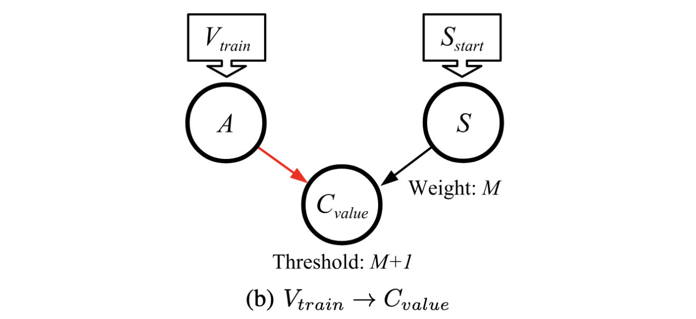

# Spiking Conversion-Networks between Values, Times and Spike Trains

James S. Plank

This repo is a companion to the paper, "Converting Between Times, Values and Spike Trains in Spiking Neural Networks", by Plank, Rizzo, Gullett, Dent and Schuman.  I'll have more information here
if/when the paper is accepted for publication and published.

------------------------------------------------------------
## Markdown Files and Videos

I have the information about these networks and examples of running them in markdown files
and videos.  They are as follows (you'll note, some markdown files / videos cover multiple
conversions):

- `V_{train} -> V_{value}`: This README and the video in [X](x).
- `V_{train} -> V_{time}`:
   Markdown in [markdown/03_Train_to_V_Time.md](markdown/03_Train_to_V_Time.md), video in [X](x).
- `V_{train} -> C_{value}`: This README and the video in [X](x).
- `V_{train} -> C_{time}`:
   Markdown in [markdown/04_Train_to_C_Time.md](markdown/04_Train_to_C_Time.md), video in [X](x).
- `V_{train} -> C_{train}`:
   Markdown in [markdown/04_Train_to_C_Time.md](markdown/04_Train_to_C_Time.md), video in [X](x).

- `V_{time} -> V_{train}`:
   Markdown in [markdown/05_Time_to_V_Train.md](markdown/05_Time_to_V_Train.md), video in [X](x).
- `V_{time} -> V_{value}`:
   Markdown in [markdown/05_Time_to_V_Train.md](markdown/05_Time_to_V_Train.md), video in [X](x).
- `V_{time} -> C_{time}`:
   Markdown in [markdown/06_Time_to_Complements.md](markdown/06_Time_to_Complements.md), video in [X](x).
- `V_{time} -> C_{value}`:
   Markdown in [markdown/06_Time_to_Complements.md](markdown/06_Time_to_Complements.md), video in [X](x).
- `V_{time} -> C_{train}`:
   Markdown in [markdown/06_Time_to_Complements.md](markdown/06_Time_to_Complements.md), video in [X](x).

- `V_{value} -> V_{train}`:
   Markdown in [markdown/07_Value_to_V_Train.md](markdown/07_Value_to_V_Train.md), video in [X](x).
- `V_{value} -> V_{time}`:
   Markdown in [markdown/07_Value_to_V_Train.md](markdown/07_Value_to_V_Train.md), video in [X](x).
- `V_{value} -> C_{time}`:
   Markdown in [markdown/08_Value_to_Complements.md](markdown/08_Value_to_Complements.md), video in [X](x).
- `V_{value} -> C_{value}`:
   Markdown in [markdown/08_Value_to_Complements.md](markdown/08_Value_to_Complements.md), video in [X](x).
- `V_{value} -> C_{train}`:
   Markdown in [markdown/08_Value_to_Complements.md](markdown/08_Value_to_Complements.md), video in [X](x).

------------------------------------------------------------
## Purpose of these Networks

There are three techniques (among many) to store and communicate values in spiking neural networks:

- Values, which are either communicated as inputs from a host, or stored in neuron potentials.
- Times, where the time that a neuron spikes communicates a value with respect to a reference time.
- Spike Trains, where a train of *n* spikes communicates the value *n*.

In the paper referenced above, we describe networks to convert between each of these to each
of the others.  Moreover, we show how to convert between a value in one technique, to its
complement in another, where the complement of *v* is defined to be *M-v*, where *M* is the
maximum value that *v* can be.

------------------------------------------------------------
## RISP Neuroprocessor and open source simulator / FPGA

These networks are presented for the RISP neuroprocessor, which is a
very simple Integrate-and-Fire neuron, with open source support at
[https://github.com/TENNLab-UTK/framework-open](https://github.com/TENNLab-UTK/framework-open).
The open source support includes tools for creating and manipulating
SNNs for RISP, and for simulating the networks running on the RISP
neuroprocessor.  RISP networks may also be rendered for execution on
FPGA with open source support at
[https://github.com/TENNLab-UTK/fpga](https://github.com/TENNLab-UTK/fpga).

------------------------------------------------------------
## The Networks

There are 15 conversions that you can make betwen the various techniques, and we present
eight networks that do these conversions.  We also present three additional networks:

1. One way that SNN's make binary decisions is to have two output neurons, and the one that spikes
   the most is the winner.  This network converts the spikes on the output neurons into a single
   spike on one of two new output neurons, so that if the first output spikes more, there is a
   single spike on one of the two new outputs, and if the second output spikes more, there 
   is a single spike on the other output.  Ties are broken in favor of the first output.
   We call this a "voting" network.

2. We have trained a network to perform classification using the 
   [MAGIC Gamma Telescore dataset](https://archive.ics.uci.edu/dataset/159/magic+gamma+telescope).
   This network uses spike trains of up to 48 spikes for each feature of the dataset.  We convert
   this network so that the input is a value between 0 and 47, and the classification is a single
   spike on one of two output neurons.

3. We have trained a network to perform the "Hardest" setting on the Cart-Pole problem.  This
   network employs an "argyle" encoder so that each of the two observations is converted to
   nine spikes that are applied to two of four input neurons.  We augment this network so that
   values may be sent from the host, and again a single spike on one of two output neurons
   determines the action for the agent.

We present all of the networks below.

------------------------------------------------------------
## Figure 3 from the paper -- converting spike trains to values

In Figure 3 of the paper, we present a simple network to convert a value represented by a 
spike train, to a neuron that stores its value in its potential.  We present storing both
the value and its complement.   Here are the two networks:


Now, what we're going to do is demonstrate how the networks work.  I'm going to do this
with some shell scripts that create networks using the `network_tool` from the 
[open source framework](https://github.com/TENNLab-UTK/framework-open), and then run
them with the `processor_tool_risp` program to demonstrate how they work.

Here's the first one.  I have comments inline:

```
UNIX> echo $fro                                   # This is the directory for the open-source framework
/Users/plank/src/repos/framework-open
UNIX> sh scripts/01_Train_To_V_Val.sh             # Here's how you call this script
usage: sh scripts/01_Train_To_V_Val.sh.sh M V framework_open_dir  - use -1 for V to not run

                                                  # We'll call it with a value of 3 and a max of 8
UNIX> sh scripts/01_Train_To_V_Val.sh  8 3 $fro
Time 0(V_value) | 0(V_value)
   0          - |          1
   1          - |          2
   2          - |          3                      # As you can see, neuron 0's potential becomes 3.
   3          - |          3
   4          - |          3
   5          - |          3
   6          - |          3
   7          - |          3
UNIX> sh scripts/01_Train_To_V_Val.sh  8 4 $fro
Time 0(V_value) | 0(V_value)
   0          - |          1
   1          - |          2
   2          - |          3
   3          - |          4                      # And when we call it with a value of 4, the 
   4          - |          4                      # potential of neuron 0 becomes 4.
   5          - |          4
   6          - |          4
   7          - |          4
UNIX> sh scripts/01_Train_To_V_Val.sh  8 8 $fro
Time 0(V_value) | 0(V_value)
   0          - |          1
   1          - |          2
   2          - |          3
   3          - |          4
   4          - |          5
   5          - |          6
   6          - |          7       # We run it for 8 timesteps, because the maximum value of
   7          - |          8       # 8 takes that many timesteps to accumulate from all the spikes.
UNIX> 
```

Now, these scripts create three files:

- `tmp_emptynet.txt` - This is an empty network with the processor parameters of RISP that we
   want to use.
- `tmp_network.txt` - This is the network.
- `tmp_pt_input.txt` - This is input to `$fro/bin/processor_tool_risp` that demonstrates how
                       this network works.

We can use these files to illustrate how the network works:

```
UNIX> $fro/bin/network_tool           # First, use the network_tool to look at the network:
FJ tmp_network.txt
INFO
Nodes:          1
Edges:          0
Inputs:         1
Outputs:        1

Input nodes:  0(V_value) 
Hidden nodes: 
Output nodes: 0(V_value) 
NODES
[ {"id":0,"name":"V_value","values":[9.0]} ]     # There's just one node.  Here it is.
Q
UNIX> $fro/bin/processor_tool_risp 
ML tmp_network.txt                         # Load the network, which also instantiates the
                                           # processor with the correct parameters.
ASV 0 0 1    0 1 1    0 2 1                # Put a train of three spikes into the network.
RUN 8                                      # Run it for 8 timesteps.
NCH
Node 0(V_value) charge: 3                  # And you can see that neuron 0 has a potential of 3
Q  
UNIX> 
```

The script in `tmp_pt_input.txt` has commands for the processor tool:

```
UNIX> cat tmp_pt_input.txt 
ML tmp_network.txt
ASV 0 0 1                      # It applies a spike train of 8 spikes.
ASV 0 1 1                      # "ASV" says to apply the value given in the 3rd argument (1).
ASV 0 2 1
ASV 0 3 1
ASV 0 4 1
ASV 0 5 1
ASV 0 6 1
ASV 0 7 1
RSC 8                          # RSC stands for "run, show spike raster & charge info".
UNIX> $fro/bin/processor_tool_risp < tmp_pt_input.txt
Time 0(V_value) | 0(V_value)
   0          - |          1
   1          - |          2
   2          - |          3
   3          - |          4
   4          - |          5
   5          - |          6
   6          - |          7
   7          - |          8
UNIX> 
```

------------------------------------------------------------
### Converting spike trains to value complements with Figure 3(b)

Let's take a look at the network in Figure 3(b) again:



The script in `scripts/02_Train_To_C_Val.sh` creates this network and then runs it
using `RSC`, so that you can see the neurons' spiking behavior and charge values.

```
UNIX> sh scripts/02_Train_To_C_Val.sh   # Here's how you run it.
usage: sh scripts/02_Train_To_C_Val.sh M V os_framework - use -1 for V to not run

# As you can see in this call, the spike train subtracts from C_value, so that at the
# end, it contains the complement as its potential.
#
UNIX> sh scripts/02_Train_To_C_Val.sh 8 3 $fro
Time       0(A)       1(S) 2(C_value) |       0(A)       1(S) 2(C_value)
   0          *          *          - |          0          0          0
   1          *          -          - |          0          0          7
   2          *          -          - |          0          0          6
   3          -          -          - |          0          0          5
   4          -          -          - |          0          0          5
   5          -          -          - |          0          0          5
   6          -          -          - |          0          0          5
   7          -          -          - |          0          0          5
   8          -          -          - |          0          0          5
UNIX> sh scripts/02_Train_To_C_Val.sh 8 5 $fro
Time       0(A)       1(S) 2(C_value) |       0(A)       1(S) 2(C_value)
   0          *          *          - |          0          0          0
   1          *          -          - |          0          0          7
   2          *          -          - |          0          0          6
   3          *          -          - |          0          0          5
   4          *          -          - |          0          0          4
   5          -          -          - |          0          0          3
   6          -          -          - |          0          0          3
   7          -          -          - |          0          0          3
   8          -          -          - |          0          0          3
UNIX> sh scripts/02_Train_To_C_Val.sh 8 8 $fro
Time       0(A)       1(S) 2(C_value) |       0(A)       1(S) 2(C_value)
   0          *          *          - |          0          0          0
   1          *          -          - |          0          0          7
   2          *          -          - |          0          0          6
   3          *          -          - |          0          0          5
   4          *          -          - |          0          0          4
   5          *          -          - |          0          0          3
   6          *          -          - |          0          0          2
   7          *          -          - |          0          0          1
   8          -          -          - |          0          0          0
UNIX> 
```


