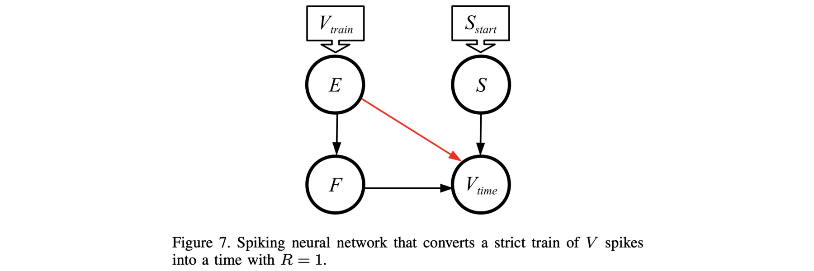

# Network to convert a spike train to a time: V_{train} -> V_{time}

This is Figure 7 in the paper:



If you haven't done so already, I recommend going through the
[main README for this repo](../README.md), and its 
[accompanying video](X).  That will get you familiar with RISP, the open-source framework,
and how we walk through these networks.

The main shell script for this network is 
`scripts/03_Train_to_V_Time.sh`.  You call it with the maximum value *M*, the value
you want to convert, and the open-source framework:

```
UNIX> echo $fro
/Users/plank/src/repos/framework-open
UNIX> sh scripts/03_Train_to_V_Time.sh 
usage: sh scripts/st_t.sh M V os_framework - use -1 for V to not run
UNIX> sh scripts/03_Train_to_V_Time.sh 8 3 $fro
Time      0(E)      1(S)      2(F) 3(V_time) |      0(E)      1(S)      2(F) 3(V_time)
   0         *         *         -         - |         0         0         0         0
   1         *         -         *         - |         0         0         0         0
   2         *         -         *         - |         0         0         0         0
   3         -         -         *         - |         0         0         0         0
   4         -         -         -         * |         0         0         0         0
   5         -         -         -         - |         0         0         0         0
   6         -         -         -         - |         0         0         0         0
   7         -         -         -         - |         0         0         0         0
   8         -         -         -         - |         0         0         0         0
   9         -         -         -         - |         0         0         0         0
UNIX> 
```

The important thing here is the spike on neuron 3 ("V_time").  It spikes on timestep
*Val+1*.  So above, with a value of 3, it spikes on timestep 4.
When we try a value of 4, it spikes on timestep 5:

```
UNIX> sh scripts/03_Train_to_V_Time.sh 8 4 $fro
Time      0(E)      1(S)      2(F) 3(V_time) |      0(E)      1(S)      2(F) 3(V_time)
   0         *         *         -         - |         0         0         0         0
   1         *         -         *         - |         0         0         0         0
   2         *         -         *         - |         0         0         0         0
   3         *         -         *         - |         0         0         0         0
   4         -         -         *         - |         0         0         0         0
   5         -         -         -         * |         0         0         0         0
   6         -         -         -         - |         0         0         0         0
   7         -         -         -         - |         0         0         0         0
   8         -         -         -         - |         0         0         0         0
   9         -         -         -         - |         0         0         0         0
UNIX> 
```

When we do 8 spikes, then V_time spikes on timestep 9:

```
UNIX> sh scripts/03_Train_to_V_Time.sh 8 8 $fro
Time      0(E)      1(S)      2(F) 3(V_time) |      0(E)      1(S)      2(F) 3(V_time)
   0         *         *         -         - |         0         0         0         0
   1         *         -         *         - |         0         0         0         0
   2         *         -         *         - |         0         0         0         0
   3         *         -         *         - |         0         0         0         0
   4         *         -         *         - |         0         0         0         0
   5         *         -         *         - |         0         0         0         0
   6         *         -         *         - |         0         0         0         0
   7         *         -         *         - |         0         0         0         0
   8         -         -         *         - |         0         0         0         0
   9         -         -         -         * |         0         0         0         0
UNIX> 
```

And of course, if we do a spike train of 0, then V_time spikes on timestep 1:

```
UNIX> sh scripts/03_Train_to_V_Time.sh 8 0 $fro
Time      0(E)      1(S)      2(F) 3(V_time) |      0(E)      1(S)      2(F) 3(V_time)
   0         -         *         -         - |         0         0         0         0
   1         -         -         -         * |         0         0         0         0
   2         -         -         -         - |         0         0         0         0
   3         -         -         -         - |         0         0         0         0
   4         -         -         -         - |         0         0         0         0
   5         -         -         -         - |         0         0         0         0
   6         -         -         -         - |         0         0         0         0
   7         -         -         -         - |         0         0         0         0
   8         -         -         -         - |         0         0         0         0
   9         -         -         -         - |         0         0         0         0
UNIX> 
```

Let's look at the network -- see how it matches with the figure above:

```
UNIX> $fro/bin/network_tool
FJ tmp_network.txt
NODES
[ {"id":3,"name":"V_time","values":[1.0]},
  {"id":0,"name":"E","values":[1.0]},
  {"id":2,"name":"F","values":[1.0]},
  {"id":1,"name":"S","values":[1.0]} ]
EDGES
[ {"from":0,"to":3,"values":[-1.0,1.0]},
  {"from":1,"to":3,"values":[1.0,1.0]},
  {"from":2,"to":3,"values":[1.0,1.0]},
  {"from":0,"to":2,"values":[1.0,1.0]} ]
Q
UNIX> 
```

And finally, look at the input for the processor tool, when we use a spike train of three:

```
UNIX> sh scripts/03_Train_to_V_Time.sh 8 3 $fro > /dev/null
UNIX> cat tmp_pt_input.txt 
ML tmp_network.txt
AS 0 0 1                    # Here's the train of three spikes.
AS 0 1 1
AS 0 2 1
AS 1 0 1                    # And here's the spike to the S neuron.
RSC 10                      # Run for M+2 timesteps and show spike raster + charges.
UNIX> $fro/bin/processor_tool_risp < tmp_pt_input.txt 
Time      0(E)      1(S)      2(F) 3(V_time) |      0(E)      1(S)      2(F) 3(V_time)
   0         *         *         -         - |         0         0         0         0
   1         *         -         *         - |         0         0         0         0
   2         *         -         *         - |         0         0         0         0
   3         -         -         *         - |         0         0         0         0
   4         -         -         -         * |         0         0         0         0
   5         -         -         -         - |         0         0         0         0
   6         -         -         -         - |         0         0         0         0
   7         -         -         -         - |         0         0         0         0
   8         -         -         -         - |         0         0         0         0
   9         -         -         -         - |         0         0         0         0
UNIX> 
```
