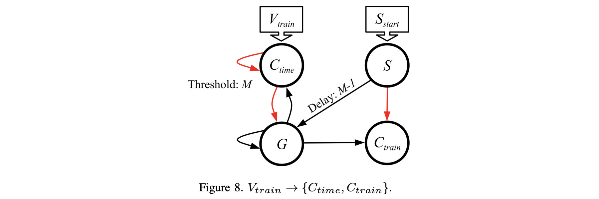

# Network to convert a spike train to a complement time or spike train: V_{train} -> C_{time} and V_{train} -> C_{train}

The video for this markdown file is in [https://youtu.be/vjWfsDhbm54](https://youtu.be/vjWfsDhbm54).

This is Figure 8 in the paper:



If you haven't done so already, I recommend going through the
[main README for this repo](../README.md), and its 
[accompanying video](https://youtu.be/shubU9zfBAA).  That will get you familiar with RISP, the open-source framework,
and how we walk through these networks.

The main shell script for this network is 
`scripts/04_Train_to_C_Time.sh`.  You call it with the maximum value *M*, the value
you want to convert, and the open-source framework:


```
UNIX> echo $fro
/Users/plank/src/repos/framework-open
UNIX> sh scripts/04_Train_to_C_Time.sh 
usage: sh scripts/04_Train_to_C_Time.sh M V os_framework - use -1 for V to not run
UNIX> 

# V = 3 and M = 8 means C = 5.
# As you can see below, C_train spikes 5 times, starting at timestep 9,  and
# C_time spikes at time 12.  The reference time is 7, so 12-7 = 5.

UNIX> sh scripts/04_Train_to_C_Time.sh 8 3 $fro
Time  0(C_time)       1(S)       2(G) 3(C_train) |  0(C_time)       1(S)       2(G) 3(C_train)
   0          -          *          -          - |          1          0          0          0
   1          -          -          -          - |          2          0          0         -1
   2          -          -          -          - |          3          0          0         -1
   3          -          -          -          - |          3          0          0         -1
   4          -          -          -          - |          3          0          0         -1
   5          -          -          -          - |          3          0          0         -1
   6          -          -          -          - |          3          0          0         -1
   7          -          -          *          - |          3          0          0         -1
   8          -          -          *          - |          4          0          0          0
   9          -          -          *          * |          5          0          0          0
  10          -          -          *          * |          6          0          0          0
  11          -          -          *          * |          7          0          0          0
  12          *          -          *          * |          0          0          0          0
  13          -          -          -          * |          0          0          0          0
  14          -          -          -          - |          0          0          0          0
  15          -          -          -          - |          0          0          0          0
  16          -          -          -          - |          0          0          0          0
UNIX>

# V = 4 and M = 8 means C = 4.
# As you can see below, C_train spikes 4 times, starting at timestep 9,  and
# C_time spikes at time 11.  The reference time is 7, so 11-7 = 4.

UNIX> sh scripts/04_Train_to_C_Time.sh 8 4 $fro
Time  0(C_time)       1(S)       2(G) 3(C_train) |  0(C_time)       1(S)       2(G) 3(C_train)
   0          -          *          -          - |          1          0          0          0
   1          -          -          -          - |          2          0          0         -1
   2          -          -          -          - |          3          0          0         -1
   3          -          -          -          - |          4          0          0         -1
   4          -          -          -          - |          4          0          0         -1
   5          -          -          -          - |          4          0          0         -1
   6          -          -          -          - |          4          0          0         -1
   7          -          -          *          - |          4          0          0         -1
   8          -          -          *          - |          5          0          0          0
   9          -          -          *          * |          6          0          0          0
  10          -          -          *          * |          7          0          0          0
  11          *          -          *          * |          0          0          0          0
  12          -          -          -          * |          0          0          0          0
  13          -          -          -          - |          0          0          0          0
  14          -          -          -          - |          0          0          0          0
  15          -          -          -          - |          0          0          0          0
  16          -          -          -          - |          0          0          0          0
UNIX>

# V = 0 and M = 8 means C = 8.
# As you can see below, C_train spikes 8 times, starting at timestep 9,  and
# C_time spikes at time 15.  The reference time is 7, so 15-7 = 8.

UNIX> sh scripts/04_Train_to_C_Time.sh 8 0 $fro
Time  0(C_time)       1(S)       2(G) 3(C_train) |  0(C_time)       1(S)       2(G) 3(C_train)
   0          -          *          -          - |          0          0          0          0
   1          -          -          -          - |          0          0          0         -1
   2          -          -          -          - |          0          0          0         -1
   3          -          -          -          - |          0          0          0         -1
   4          -          -          -          - |          0          0          0         -1
   5          -          -          -          - |          0          0          0         -1
   6          -          -          -          - |          0          0          0         -1
   7          -          -          *          - |          0          0          0         -1
   8          -          -          *          - |          1          0          0          0
   9          -          -          *          * |          2          0          0          0
  10          -          -          *          * |          3          0          0          0
  11          -          -          *          * |          4          0          0          0
  12          -          -          *          * |          5          0          0          0
  13          -          -          *          * |          6          0          0          0
  14          -          -          *          * |          7          0          0          0
  15          *          -          *          * |          0          0          0          0
  16          -          -          -          * |          0          0          0          0
UNIX>

# V = 8 and M = 8 means C = 0.  See if you can figure out the rest.

UNIX> sh scripts/04_Train_to_C_Time.sh 8 8 $fro
Time  0(C_time)       1(S)       2(G) 3(C_train) |  0(C_time)       1(S)       2(G) 3(C_train)
   0          -          *          -          - |          1          0          0          0
   1          -          -          -          - |          2          0          0         -1
   2          -          -          -          - |          3          0          0         -1
   3          -          -          -          - |          4          0          0         -1
   4          -          -          -          - |          5          0          0         -1
   5          -          -          -          - |          6          0          0         -1
   6          -          -          -          - |          7          0          0         -1
   7          *          -          *          - |          0          0          0         -1
   8          -          -          -          - |          0          0          0          0
   9          -          -          -          - |          0          0          0          0
  10          -          -          -          - |          0          0          0          0
  11          -          -          -          - |          0          0          0          0
  12          -          -          -          - |          0          0          0          0
  13          -          -          -          - |          0          0          0          0
  14          -          -          -          - |          0          0          0          0
  15          -          -          -          - |          0          0          0          0
  16          -          -          -          - |          0          0          0          0
UNIX> 
```

Let's take a look at the network.  See how it matches the picture above:

```
UNIX> ( echo FJ tmp_network.txt ; echo SORT Q ; echo TJ ) | $fro/bin/network_tool
{ "Properties":
  { "node_properties": [
      { "name":"Threshold", "type":73, "index":0, "size":1, "min_value":0.0, "max_value":8.0 }],
    "edge_properties": [
      { "name":"Delay", "type":73, "index":1, "size":1, "min_value":1.0, "max_value":8.0 },
      { "name":"Weight", "type":73, "index":0, "size":1, "min_value":-8.0, "max_value":8.0 }],
    "network_properties": [] },
 "Nodes":
  [ {"id":0,"name":"C_time","values":[8.0]},
    {"id":1,"name":"S","values":[1.0]},
    {"id":2,"name":"G","values":[1.0]},
    {"id":3,"name":"C_train","values":[1.0]} ],
 "Edges":
  [ {"from":0,"to":0,"values":[-1.0,1.0]},
    {"from":0,"to":2,"values":[-1.0,1.0]},
    {"from":1,"to":2,"values":[1.0,7.0]},
    {"from":1,"to":3,"values":[-1.0,1.0]},
    {"from":2,"to":0,"values":[1.0,1.0]},
    {"from":2,"to":2,"values":[1.0,1.0]},
    {"from":2,"to":3,"values":[1.0,1.0]} ],
 "Inputs": [0,1],
 "Outputs": [0,3],
 "Network_Values": [],
 "Associated_Data":
   { "other": {"proc_name":"risp"},
     "proc_params": 
      { "discrete": true,
        "fire_like_ravens": false,
        "leak_mode": "none",
        "max_delay": 8,
        "max_threshold": 8.0,
        "max_weight": 8.0,
        "min_potential": -8.0,
        "min_threshold": 0.0,
        "min_weight": -8.0,
        "run_time_inclusive": false,
        "spike_value_factor": 8.0,
        "threshold_inclusive": true}}}
UNIX> 
```

Finally, let's take a look at the processor_tool commands when V=3:

```
UNIX> sh scripts/04_Train_to_C_Time.sh 8 3 $fro > /dev/null
UNIX> cat tmp_pt_input.txt 
ML tmp_network.txt
ASV 0 0 1                # This inputs a train of three spikes with values = 1
ASV 0 1 1
ASV 0 2 1
ASV 1 0 1                # Spike the S neuron at time 0
RSC 17                   # Run for 17 timesteps and show the spike raster + charges:
UNIX> $fro/bin/processor_tool_risp < tmp_pt_input.txt 
Time  0(C_time)       1(S)       2(G) 3(C_train) |  0(C_time)       1(S)       2(G) 3(C_train)
   0          -          *          -          - |          1          0          0          0
   1          -          -          -          - |          2          0          0         -1
   2          -          -          -          - |          3          0          0         -1
   3          -          -          -          - |          3          0          0         -1
   4          -          -          -          - |          3          0          0         -1
   5          -          -          -          - |          3          0          0         -1
   6          -          -          -          - |          3          0          0         -1
   7          -          -          *          - |          3          0          0         -1
   8          -          -          *          - |          4          0          0          0
   9          -          -          *          * |          5          0          0          0
  10          -          -          *          * |          6          0          0          0
  11          -          -          *          * |          7          0          0          0
  12          *          -          *          * |          0          0          0          0
  13          -          -          -          * |          0          0          0          0
  14          -          -          -          - |          0          0          0          0
  15          -          -          -          - |          0          0          0          0
  16          -          -          -          - |          0          0          0          0
UNIX> 
```
