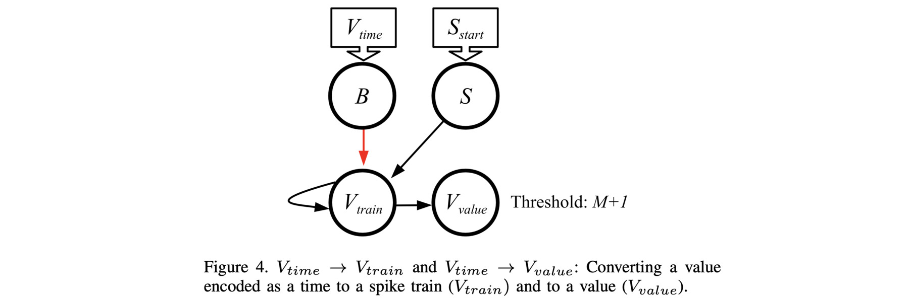

# Network to convert a time to a value or spike train: V_{time} -> V_{value} and V_{time} -> V_{train}

The video for this markdown file is in [https://youtu.be/xlB4ZxbSuXQ](https://youtu.be/xlB4ZxbSuXQ).

This is Figure 4 in the paper:



If you haven't done so already, I recommend going through the
[main README for this repo](../README.md), and its 
[accompanying video](https://youtu.be/shubU9zfBAA).  That will get you familiar with RISP, the open-source framework,
and how we walk through these networks.

The main shell script for this network is 
`scripts/05_Time_to_V_Train.sh`.  You call it with the maximum value *M*, the value
you want to convert, and the open-source framework:


```
UNIX> echo $fro
/Users/plank/src/repos/framework-open
UNIX> sh scripts/05_Time_to_V_Train.sh 
usage: sh scripts/05_Time_to_V_Train.sh M V os_framework - use -1 for V to not run
UNIX> sh scripts/05_Time_to_V_Train.sh 8 3 $fro

# V = 3 and M = 8.
# As you can see below, V_train spikes 3 times, starting at timestep 1,  and
# V_value gets a value of three by timestep 4.  To allow for all values of V,
# you need to run this for 10 timesteps, so that the V_Value neuron has time to
# receive 8 spikes when V = 8.  If you are not using V_Value, you may delete the
# neuron and only run the network for 9 timesteps.

Time       0(B)       1(S) 2(V_train) 3(V_value) |       0(B)       1(S) 2(V_train) 3(V_value)
   0          -          *          -          - |          0          0          0          0
   1          -          -          *          - |          0          0          0          0
   2          -          -          *          - |          0          0          0          1
   3          *          -          *          - |          0          0          0          2
   4          -          -          -          - |          0          0          0          3
   5          -          -          -          - |          0          0          0          3
   6          -          -          -          - |          0          0          0          3
   7          -          -          -          - |          0          0          0          3
   8          -          -          -          - |          0          0          0          3
   9          -          -          -          - |          0          0          0          3
UNIX> sh scripts/05_Time_to_V_Train.sh 8 4 $fro

# V = 4 and M = 8.
# As you can see below, V_train spikes 4 times, starting at timestep 1,  and
# V_value gets a value of four.

Time       0(B)       1(S) 2(V_train) 3(V_value) |       0(B)       1(S) 2(V_train) 3(V_value)
   0          -          *          -          - |          0          0          0          0
   1          -          -          *          - |          0          0          0          0
   2          -          -          *          - |          0          0          0          1
   3          -          -          *          - |          0          0          0          2
   4          *          -          *          - |          0          0          0          3
   5          -          -          -          - |          0          0          0          4
   6          -          -          -          - |          0          0          0          4
   7          -          -          -          - |          0          0          0          4
   8          -          -          -          - |          0          0          0          4
   9          -          -          -          - |          0          0          0          4
UNIX> sh scripts/05_Time_to_V_Train.sh 8 8 $fro

# V = 8 and M = 8.
# As you can see below, V_train spikes 8 times, starting at timestep 1,  and
# V_value gets a value of eight.  This is why you need to run the network for 10
# timesteps, because in this case, V_value does not get its last incoming spike until
# timestep 9.

Time       0(B)       1(S) 2(V_train) 3(V_value) |       0(B)       1(S) 2(V_train) 3(V_value)
   0          -          *          -          - |          0          0          0          0
   1          -          -          *          - |          0          0          0          0
   2          -          -          *          - |          0          0          0          1
   3          -          -          *          - |          0          0          0          2
   4          -          -          *          - |          0          0          0          3
   5          -          -          *          - |          0          0          0          4
   6          -          -          *          - |          0          0          0          5
   7          -          -          *          - |          0          0          0          6
   8          *          -          *          - |          0          0          0          7
   9          -          -          -          - |          0          0          0          8
UNIX> sh scripts/05_Time_to_V_Train.sh 8 0 $fro

# V = 0 and M = 8.
# No spikes on V_train, and V_value is always zero.

Time       0(B)       1(S) 2(V_train) 3(V_value) |       0(B)       1(S) 2(V_train) 3(V_value)
   0          *          *          -          - |          0          0          0          0
   1          -          -          -          - |          0          0          0          0
   2          -          -          -          - |          0          0          0          0
   3          -          -          -          - |          0          0          0          0
   4          -          -          -          - |          0          0          0          0
   5          -          -          -          - |          0          0          0          0
   6          -          -          -          - |          0          0          0          0
   7          -          -          -          - |          0          0          0          0
   8          -          -          -          - |          0          0          0          0
   9          -          -          -          - |          0          0          0          0
UNIX> 
```

Let's take a look at the network.  See how it matches the picture above:

```
UNIX> ( echo FJ tmp_network.txt ; echo SORT Q ; echo TJ ) | $fro/bin/network_tool
{ "Properties":
  { "node_properties": [
      { "name":"Threshold", "type":73, "index":0, "size":1, "min_value":0.0, "max_value":9.0 }],
    "edge_properties": [
      { "name":"Delay", "type":73, "index":1, "size":1, "min_value":1.0, "max_value":9.0 },
      { "name":"Weight", "type":73, "index":0, "size":1, "min_value":-9.0, "max_value":9.0 }],
    "network_properties": [] },
 "Nodes":
  [ {"id":0,"name":"B","values":[1.0]},
    {"id":1,"name":"S","values":[1.0]},
    {"id":2,"name":"V_train","values":[1.0]},
    {"id":3,"name":"V_value","values":[9.0]} ],
 "Edges":
  [ {"from":0,"to":2,"values":[-1.0,1.0]},
    {"from":1,"to":2,"values":[1.0,1.0]},
    {"from":2,"to":2,"values":[1.0,1.0]},
    {"from":2,"to":3,"values":[1.0,1.0]} ],
 "Inputs": [0,1],
 "Outputs": [2,3],
 "Network_Values": [],
 "Associated_Data":
   { "other": {"proc_name":"risp"},
     "proc_params": 
      { "discrete": true,
        "fire_like_ravens": false,
        "leak_mode": "none",
        "max_delay": 9,
        "max_threshold": 9.0,
        "max_weight": 9.0,
        "min_potential": -9.0,
        "min_threshold": 0.0,
        "min_weight": -9.0,
        "run_time_inclusive": false,
        "spike_value_factor": 9.0,
        "threshold_inclusive": true}}}
UNIX> 
```

Finally, let's take a look at the processor_tool commands when V=3:

```
UNIX> sh scripts/05_Time_to_V_Train.sh 8 3 $fro > /dev/null
UNIX> cat tmp_pt_input.txt
ML tmp_network.txt
AS 0 3 1                    # Here's the spike to the B neuron at time 3.
AS 1 0 1                    # Here's the spike to the S neuron at time 0.
RSC 10                      # Run it for 10 timesteps and show the spikes and the potentials.
UNIX> $fro/bin/processor_tool_risp < tmp_pt_input.txt
Time       0(B)       1(S) 2(V_train) 3(V_value) |       0(B)       1(S) 2(V_train) 3(V_value)
   0          -          *          -          - |          0          0          0          0
   1          -          -          *          - |          0          0          0          0
   2          -          -          *          - |          0          0          0          1
   3          *          -          *          - |          0          0          0          2
   4          -          -          -          - |          0          0          0          3
   5          -          -          -          - |          0          0          0          3
   6          -          -          -          - |          0          0          0          3
   7          -          -          -          - |          0          0          0          3
   8          -          -          -          - |          0          0          0          3
   9          -          -          -          - |          0          0          0          3
UNIX> 
```
