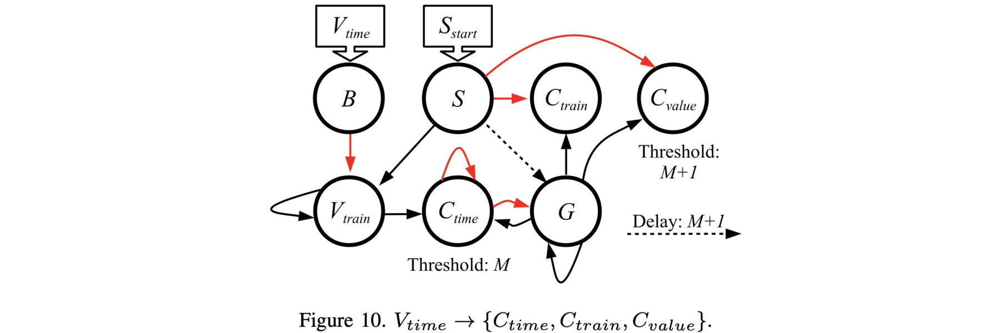

# Network to convert a time to its complement in all three encodings: V_{time} -> C_{value}, V_{time} -> C_{time} and V_{time} -> C_{train}

This is Figure 10 in the paper:



If you haven't done so already, I recommend going through the
[main README for this repo](../README.md), and its 
[accompanying video](X).  That will get you familiar with RISP, the open-source framework,
and how we walk through these networks.

The main shell script for this network is 
`scripts/06_Time_to_Complements.sh.sh`.  You call it with the maximum value *M*, the value
you want to convert, and the open-source framework:

```
UNIX> echo $fro
/Users/plank/src/repos/framework-open
UNIX> sh scripts/06_Time_to_Complements.sh 
usage: sh scripts/06_Time_to_Complements.sh M V os_framework - use -1 for V to not run
UNIX> sh scripts/06_Time_to_Complements.sh 8 3 $fro

# V is 3 and M is 8.  Therefore, C is 5.
# In the output below, you can see that C_train spikes 5 times starting at timestep M+3 = 11.
# C_time spikes at time 9+5 = 14 (i.e. the reference time is M+1 = 9).
# C_value gets a value of 5 at timestep 15.  However, you need to wait until timestep 18
# so that C_value can gets its maximum value of 8.

Time       0(B)       1(S) 2(C_train) 3(C_value) 4(V_train)  5(C_time)       6(G) |       0(B)       1(S) 2(C_train) 3(C_value) 4(V_train)  5(C_time)       6(G)
   0          -          *          -          -          -          -          - |          0          0          0          0          0          0          0
   1          -          -          -          -          *          -          - |          0          0         -1         -1          0          0          0
   2          -          -          -          -          *          -          - |          0          0         -1         -1          0          1          0
   3          *          -          -          -          *          -          - |          0          0         -1         -1          0          2          0
   4          -          -          -          -          -          -          - |          0          0         -1         -1          0          3          0
   5          -          -          -          -          -          -          - |          0          0         -1         -1          0          3          0
   6          -          -          -          -          -          -          - |          0          0         -1         -1          0          3          0
   7          -          -          -          -          -          -          - |          0          0         -1         -1          0          3          0
   8          -          -          -          -          -          -          - |          0          0         -1         -1          0          3          0
   9          -          -          -          -          -          -          * |          0          0         -1         -1          0          3          0
  10          -          -          -          -          -          -          * |          0          0          0          0          0          4          0
  11          -          -          *          -          -          -          * |          0          0          0          1          0          5          0
  12          -          -          *          -          -          -          * |          0          0          0          2          0          6          0
  13          -          -          *          -          -          -          * |          0          0          0          3          0          7          0
  14          -          -          *          -          -          *          * |          0          0          0          4          0          0          0
  15          -          -          *          -          -          -          - |          0          0          0          5          0          0          0
  16          -          -          -          -          -          -          - |          0          0          0          5          0          0          0
  17          -          -          -          -          -          -          - |          0          0          0          5          0          0          0
  18          -          -          -          -          -          -          - |          0          0          0          5          0          0          0
UNIX> sh scripts/06_Time_to_Complements.sh 8 4 $fro

# V is 4 and M is 8.  Therefore, C is 4.
# In the output below, you can see that C_train spikes 4 times starting at timestep M+3 = 11.
# C_time spikes at time 9+4 = 13.
# C_value gets a value of 4 at timestep 14.

Time       0(B)       1(S) 2(C_train) 3(C_value) 4(V_train)  5(C_time)       6(G) |       0(B)       1(S) 2(C_train) 3(C_value) 4(V_train)  5(C_time)       6(G)
   0          -          *          -          -          -          -          - |          0          0          0          0          0          0          0
   1          -          -          -          -          *          -          - |          0          0         -1         -1          0          0          0
   2          -          -          -          -          *          -          - |          0          0         -1         -1          0          1          0
   3          -          -          -          -          *          -          - |          0          0         -1         -1          0          2          0
   4          *          -          -          -          *          -          - |          0          0         -1         -1          0          3          0
   5          -          -          -          -          -          -          - |          0          0         -1         -1          0          4          0
   6          -          -          -          -          -          -          - |          0          0         -1         -1          0          4          0
   7          -          -          -          -          -          -          - |          0          0         -1         -1          0          4          0
   8          -          -          -          -          -          -          - |          0          0         -1         -1          0          4          0
   9          -          -          -          -          -          -          * |          0          0         -1         -1          0          4          0
  10          -          -          -          -          -          -          * |          0          0          0          0          0          5          0
  11          -          -          *          -          -          -          * |          0          0          0          1          0          6          0
  12          -          -          *          -          -          -          * |          0          0          0          2          0          7          0
  13          -          -          *          -          -          *          * |          0          0          0          3          0          0          0
  14          -          -          *          -          -          -          - |          0          0          0          4          0          0          0
  15          -          -          -          -          -          -          - |          0          0          0          4          0          0          0
  16          -          -          -          -          -          -          - |          0          0          0          4          0          0          0
  17          -          -          -          -          -          -          - |          0          0          0          4          0          0          0
  18          -          -          -          -          -          -          - |          0          0          0          4          0          0          0
UNIX> sh scripts/06_Time_to_Complements.sh 8 8 $fro

# V is 8 and M is 8.  Therefore, C is 0.
# In the output below, you can see that C_train does not spike, and C_value is zero after timestep 9.
# C_time spikes at time 9+0 = 9.

Time       0(B)       1(S) 2(C_train) 3(C_value) 4(V_train)  5(C_time)       6(G) |       0(B)       1(S) 2(C_train) 3(C_value) 4(V_train)  5(C_time)       6(G)
   0          -          *          -          -          -          -          - |          0          0          0          0          0          0          0
   1          -          -          -          -          *          -          - |          0          0         -1         -1          0          0          0
   2          -          -          -          -          *          -          - |          0          0         -1         -1          0          1          0
   3          -          -          -          -          *          -          - |          0          0         -1         -1          0          2          0
   4          -          -          -          -          *          -          - |          0          0         -1         -1          0          3          0
   5          -          -          -          -          *          -          - |          0          0         -1         -1          0          4          0
   6          -          -          -          -          *          -          - |          0          0         -1         -1          0          5          0
   7          -          -          -          -          *          -          - |          0          0         -1         -1          0          6          0
   8          *          -          -          -          *          -          - |          0          0         -1         -1          0          7          0
   9          -          -          -          -          -          *          * |          0          0         -1         -1          0          0          0
  10          -          -          -          -          -          -          - |          0          0          0          0          0          0          0
  11          -          -          -          -          -          -          - |          0          0          0          0          0          0          0
  12          -          -          -          -          -          -          - |          0          0          0          0          0          0          0
  13          -          -          -          -          -          -          - |          0          0          0          0          0          0          0
  14          -          -          -          -          -          -          - |          0          0          0          0          0          0          0
  15          -          -          -          -          -          -          - |          0          0          0          0          0          0          0
  16          -          -          -          -          -          -          - |          0          0          0          0          0          0          0
  17          -          -          -          -          -          -          - |          0          0          0          0          0          0          0
  18          -          -          -          -          -          -          - |          0          0          0          0          0          0          0
UNIX> sh scripts/06_Time_to_Complements.sh 8 0 $fro

# V is 0 and M is 8.  Therefore, C is 8.
# In the output below, you can see that C_train spikes 8 times starting at timestep M+3 = 11.
# C_time spikes at time 9+8 = 17.
# C_value gets a value of 8 at timestep 18.  This is why you need to wait until timestep 18
# to look at the potential of that neuron.  

Time       0(B)       1(S) 2(C_train) 3(C_value) 4(V_train)  5(C_time)       6(G) |       0(B)       1(S) 2(C_train) 3(C_value) 4(V_train)  5(C_time)       6(G)
   0          *          *          -          -          -          -          - |          0          0          0          0          0          0          0
   1          -          -          -          -          -          -          - |          0          0         -1         -1          0          0          0
   2          -          -          -          -          -          -          - |          0          0         -1         -1          0          0          0
   3          -          -          -          -          -          -          - |          0          0         -1         -1          0          0          0
   4          -          -          -          -          -          -          - |          0          0         -1         -1          0          0          0
   5          -          -          -          -          -          -          - |          0          0         -1         -1          0          0          0
   6          -          -          -          -          -          -          - |          0          0         -1         -1          0          0          0
   7          -          -          -          -          -          -          - |          0          0         -1         -1          0          0          0
   8          -          -          -          -          -          -          - |          0          0         -1         -1          0          0          0
   9          -          -          -          -          -          -          * |          0          0         -1         -1          0          0          0
  10          -          -          -          -          -          -          * |          0          0          0          0          0          1          0
  11          -          -          *          -          -          -          * |          0          0          0          1          0          2          0
  12          -          -          *          -          -          -          * |          0          0          0          2          0          3          0
  13          -          -          *          -          -          -          * |          0          0          0          3          0          4          0
  14          -          -          *          -          -          -          * |          0          0          0          4          0          5          0
  15          -          -          *          -          -          -          * |          0          0          0          5          0          6          0
  16          -          -          *          -          -          -          * |          0          0          0          6          0          7          0
  17          -          -          *          -          -          *          * |          0          0          0          7          0          0          0
  18          -          -          *          -          -          -          - |          0          0          0          8          0          0          0
UNIX> 
```

Let's take a look at the network.  See how it matches the picture above:

```
UNIX> ( echo FJ tmp_network.txt ; echo SORT Q ; echo TJ ) | $fro/bin/network_tool
{ "Properties":
  { "node_properties": [
      { "name":"Threshold", "type":73, "index":0, "size":1, "min_value":0.0, "max_value":9.0 }],
    "edge_properties": [
      { "name":"Delay", "type":73, "index":1, "size":1, "min_value":1.0, "max_value":9.0 },
      { "name":"Weight", "type":73, "index":0, "size":1, "min_value":-9.0, "max_value":9.0 }],
    "network_properties": [] },
 "Nodes":
  [ {"id":0,"name":"B","values":[1.0]},
    {"id":1,"name":"S","values":[1.0]},
    {"id":2,"name":"C_train","values":[1.0]},
    {"id":3,"name":"C_value","values":[9.0]},
    {"id":4,"name":"V_train","values":[1.0]},
    {"id":5,"name":"C_time","values":[8.0]},
    {"id":6,"name":"G","values":[1.0]} ],
 "Edges":
  [ {"from":0,"to":4,"values":[-1.0,1.0]},
    {"from":1,"to":2,"values":[-1.0,1.0]},
    {"from":1,"to":3,"values":[-1.0,1.0]},
    {"from":1,"to":4,"values":[1.0,1.0]},
    {"from":1,"to":6,"values":[1.0,9.0]},
    {"from":4,"to":4,"values":[1.0,1.0]},
    {"from":4,"to":5,"values":[1.0,1.0]},
    {"from":5,"to":5,"values":[-1.0,1.0]},
    {"from":5,"to":6,"values":[-1.0,1.0]},
    {"from":6,"to":2,"values":[1.0,1.0]},
    {"from":6,"to":3,"values":[1.0,1.0]},
    {"from":6,"to":5,"values":[1.0,1.0]},
    {"from":6,"to":6,"values":[1.0,1.0]} ],
 "Inputs": [0,1],
 "Outputs": [2,3,5],
 "Network_Values": [],
 "Associated_Data":
   { "other": {"proc_name":"risp"},
     "proc_params": 
      { "discrete": true,
        "fire_like_ravens": false,
        "leak_mode": "none",
        "max_delay": 9,
        "max_threshold": 9.0,
        "max_weight": 9.0,
        "min_potential": -9.0,
        "min_threshold": 0.0,
        "min_weight": -9.0,
        "run_time_inclusive": false,
        "spike_value_factor": 9.0,
        "threshold_inclusive": true}}}
UNIX> 
```

Finally, let's take a look at the processor_tool commands when V=3:

```
UNIX> sh scripts/06_Time_to_Complements.sh 8 3 $fro > /dev/null
UNIX> cat tmp_pt_input.txt
ML tmp_network.txt
AS 0 3 1                    # Here's the spike to the B neuron at time 3.
AS 1 0 1                    # Here's the spike to the S neuron at time 0.
RSC 19                      # Run it for 19 timesteps and show the spikes and the potentials.
UNIX> $fro/bin/processor_tool_risp < tmp_pt_input.txt
Time       0(B)       1(S) 2(C_train) 3(C_value) 4(V_train)  5(C_time)       6(G) |       0(B)       1(S) 2(C_train) 3(C_value) 4(V_train)  5(C_time)       6(G)
   0          -          *          -          -          -          -          - |          0          0          0          0          0          0          0
   1          -          -          -          -          *          -          - |          0          0         -1         -1          0          0          0
   2          -          -          -          -          *          -          - |          0          0         -1         -1          0          1          0
   3          *          -          -          -          *          -          - |          0          0         -1         -1          0          2          0
   4          -          -          -          -          -          -          - |          0          0         -1         -1          0          3          0
   5          -          -          -          -          -          -          - |          0          0         -1         -1          0          3          0
   6          -          -          -          -          -          -          - |          0          0         -1         -1          0          3          0
   7          -          -          -          -          -          -          - |          0          0         -1         -1          0          3          0
   8          -          -          -          -          -          -          - |          0          0         -1         -1          0          3          0
   9          -          -          -          -          -          -          * |          0          0         -1         -1          0          3          0
  10          -          -          -          -          -          -          * |          0          0          0          0          0          4          0
  11          -          -          *          -          -          -          * |          0          0          0          1          0          5          0
  12          -          -          *          -          -          -          * |          0          0          0          2          0          6          0
  13          -          -          *          -          -          -          * |          0          0          0          3          0          7          0
  14          -          -          *          -          -          *          * |          0          0          0          4          0          0          0
  15          -          -          *          -          -          -          - |          0          0          0          5          0          0          0
  16          -          -          -          -          -          -          - |          0          0          0          5          0          0          0
  17          -          -          -          -          -          -          - |          0          0          0          5          0          0          0
  18          -          -          -          -          -          -          - |          0          0          0          5          0          0          0
UNIX> 
```
