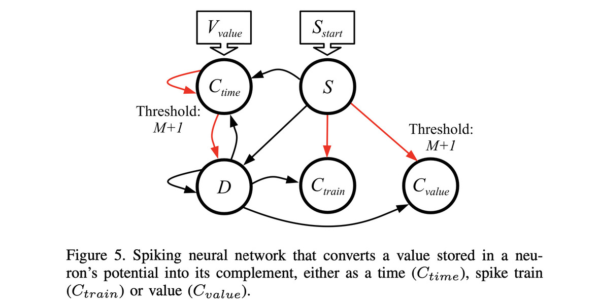

# Network to convert a value to its complement in all three encodings: V_{value} -> C_{value}, V_{value} -> C_{time} and V_{value} -> C_{train}

This is Figure 5 in the paper:



If you haven't done so already, I recommend going through the
[main README for this repo](../README.md), and its 
[accompanying video](X).  That will get you familiar with RISP, the open-source framework,
and how we walk through these networks.

The main shell script for this network is 
`scripts/06_Time_to_Complements.sh.sh`.  You call it with the maximum value *M*, the value
you want to convert, and the open-source framework:

```
UNIX> echo $fro
/Users/plank/src/repos/framework-open
UNIX> sh scripts/08_Value_to_Complements.sh
usage: sh scripts/08_Value_to_Complements.sh M V os_framework - use -1 for V to not run
UNIX> sh scripts/08_Value_to_Complements.sh 8 3 $fro

# V = 3 and M = 8.  So C = 5
# So, neuron C_time spikes at timestep 1+5 = 6.
# Neuron C_train spikes five times starting at timestep 3.
# Neuron C_value gets a potential of 5 at timestep 7.

Time  0(C_time)       1(S)       2(D) 3(C_train) 4(C_value) |  0(C_time)       1(S)       2(D) 3(C_train) 4(C_value)
   0          -          *          -          -          - |          3          0          0          0          0
   1          -          -          *          -          - |          4          0          0         -1         -1
   2          -          -          *          -          - |          5          0          0          0          0
   3          -          -          *          *          - |          6          0          0          0          1
   4          -          -          *          *          - |          7          0          0          0          2
   5          -          -          *          *          - |          8          0          0          0          3
   6          *          -          *          *          - |          0          0          0          0          4
   7          -          -          -          *          - |          0          0          0          0          5
   8          -          -          -          -          - |          0          0          0          0          5
   9          -          -          -          -          - |          0          0          0          0          5
  10          -          -          -          -          - |          0          0          0          0          5
UNIX> sh scripts/08_Value_to_Complements.sh 8 4 $fro

# V = 4 and M = 8.  So C = 4
# So, neuron C_time spikes at timestep 1+4 = 5.
# Neuron C_train spikes four times starting at timestep 3.
# Neuron C_value gets a potential of 4 at timestep 6.

Time  0(C_time)       1(S)       2(D) 3(C_train) 4(C_value) |  0(C_time)       1(S)       2(D) 3(C_train) 4(C_value)
   0          -          *          -          -          - |          4          0          0          0          0
   1          -          -          *          -          - |          5          0          0         -1         -1
   2          -          -          *          -          - |          6          0          0          0          0
   3          -          -          *          *          - |          7          0          0          0          1
   4          -          -          *          *          - |          8          0          0          0          2
   5          *          -          *          *          - |          0          0          0          0          3
   6          -          -          -          *          - |          0          0          0          0          4
   7          -          -          -          -          - |          0          0          0          0          4
   8          -          -          -          -          - |          0          0          0          0          4
   9          -          -          -          -          - |          0          0          0          0          4
  10          -          -          -          -          - |          0          0          0          0          4
UNIX> sh scripts/08_Value_to_Complements.sh 8 8 $fro

# V = 8 and M = 8.  So C = 0.
# So, neuron C_time spikes at timestep 1+0 = 1.
# Neuron C_train does not spike, and C_value has a potential of 0 after timestep 1.

Time  0(C_time)       1(S)       2(D) 3(C_train) 4(C_value) |  0(C_time)       1(S)       2(D) 3(C_train) 4(C_value)
   0          -          *          -          -          - |          8          0          0          0          0
   1          *          -          *          -          - |          0          0          0         -1         -1
   2          -          -          -          -          - |          0          0          0          0          0
   3          -          -          -          -          - |          0          0          0          0          0
   4          -          -          -          -          - |          0          0          0          0          0
   5          -          -          -          -          - |          0          0          0          0          0
   6          -          -          -          -          - |          0          0          0          0          0
   7          -          -          -          -          - |          0          0          0          0          0
   8          -          -          -          -          - |          0          0          0          0          0
   9          -          -          -          -          - |          0          0          0          0          0
  10          -          -          -          -          - |          0          0          0          0          0
UNIX> sh scripts/08_Value_to_Complements.sh 8 0 $fro

# V = 0 and M = 8.  So C = 8.
# So, neuron C_time spikes at timestep 1+8 = 9.
# Neuron C_train spikes eight times starting at timestep 3.
# Neuron C_value gets a potential of 8 at timestep 10.

Time  0(C_time)       1(S)       2(D) 3(C_train) 4(C_value) |  0(C_time)       1(S)       2(D) 3(C_train) 4(C_value)
   0          -          *          -          -          - |          0          0          0          0          0
   1          -          -          *          -          - |          1          0          0         -1         -1
   2          -          -          *          -          - |          2          0          0          0          0
   3          -          -          *          *          - |          3          0          0          0          1
   4          -          -          *          *          - |          4          0          0          0          2
   5          -          -          *          *          - |          5          0          0          0          3
   6          -          -          *          *          - |          6          0          0          0          4
   7          -          -          *          *          - |          7          0          0          0          5
   8          -          -          *          *          - |          8          0          0          0          6
   9          *          -          *          *          - |          0          0          0          0          7
  10          -          -          -          *          - |          0          0          0          0          8
UNIX> 
```

Let's take a look at the network.  See how it matches the picture above:

```
UNIX> ( echo FJ tmp_network.txt ; echo SORT Q ; echo TJ ) | $fro/bin/network_tool
{ "Properties":
  { "node_properties": [
      { "name":"Threshold", "type":73, "index":0, "size":1, "min_value":0.0, "max_value":9.0 }],
    "edge_properties": [
      { "name":"Delay", "type":73, "index":1, "size":1, "min_value":1.0, "max_value":9.0 },
      { "name":"Weight", "type":73, "index":0, "size":1, "min_value":-9.0, "max_value":9.0 }],
    "network_properties": [] },
 "Nodes":
  [ {"id":0,"name":"C_time","values":[9.0]},
    {"id":1,"name":"S","values":[1.0]},
    {"id":2,"name":"D","values":[1.0]},
    {"id":3,"name":"C_train","values":[1.0]},
    {"id":4,"name":"C_value","values":[9.0]} ],
 "Edges":
  [ {"from":0,"to":0,"values":[-1.0,1.0]},
    {"from":0,"to":2,"values":[-1.0,1.0]},
    {"from":1,"to":0,"values":[1.0,1.0]},
    {"from":1,"to":2,"values":[1.0,1.0]},
    {"from":1,"to":3,"values":[-1.0,1.0]},
    {"from":1,"to":4,"values":[-1.0,1.0]},
    {"from":2,"to":0,"values":[1.0,1.0]},
    {"from":2,"to":2,"values":[1.0,1.0]},
    {"from":2,"to":3,"values":[1.0,1.0]},
    {"from":2,"to":4,"values":[1.0,1.0]} ],
 "Inputs": [0,1],
 "Outputs": [0,3,4],
 "Network_Values": [],
 "Associated_Data":
   { "other": {"proc_name":"risp"},
     "proc_params": 
      { "discrete": true,
        "fire_like_ravens": false,
        "leak_mode": "none",
        "max_delay": 9,
        "max_threshold": 9.0,
        "max_weight": 9.0,
        "min_potential": -9.0,
        "min_threshold": 0.0,
        "min_weight": -9.0,
        "run_time_inclusive": false,
        "spike_value_factor": 9.0,
        "threshold_inclusive": true}}}
UNIX> 
```

Finally, let's take a look at the processor_tool commands when V=3:

```
UNIX> sh scripts/08_Value_to_Complements.sh 8 3 $fro > /dev/null
UNIX> cat tmp_pt_input.txt
ML tmp_network.txt
ASV 0 0 3                   # Apply a value of 3 to the B neuron (ASV applies a value, while AS normalizes).
AS 1 0 1                    # Make sure S spikes at timestep 0.
RSC 11                      # Run it for 11 timesteps and show the spikes and the potentials.
UNIX> 
UNIX> $fro/bin/processor_tool_risp < tmp_pt_input.txt
Time       0(B)       1(S) 2(C_train) 3(C_value) 4(V_train)  5(C_time)       6(G) |       0(B)       1(S) 2(C_train) 3(C_value) 4(V_train)  5(C_time)       6(G)
   0          -          *          -          -          -          -          - |          0          0          0          0          0          0          0
   1          -          -          -          -          *          -          - |          0          0         -1         -1          0          0          0
   2          -          -          -          -          *          -          - |          0          0         -1         -1          0          1          0
   3          *          -          -          -          *          -          - |          0          0         -1         -1          0          2          0
   4          -          -          -          -          -          -          - |          0          0         -1         -1          0          3          0
   5          -          -          -          -          -          -          - |          0          0         -1         -1          0          3          0
   6          -          -          -          -          -          -          - |          0          0         -1         -1          0          3          0
   7          -          -          -          -          -          -          - |          0          0         -1         -1          0          3          0
   8          -          -          -          -          -          -          - |          0          0         -1         -1          0          3          0
   9          -          -          -          -          -          -          * |          0          0         -1         -1          0          3          0
  10          -          -          -          -          -          -          * |          0          0          0          0          0          4          0
  11          -          -          *          -          -          -          * |          0          0          0          1          0          5          0
  12          -          -          *          -          -          -          * |          0          0          0          2          0          6          0
  13          -          -          *          -          -          -          * |          0          0          0          3          0          7          0
  14          -          -          *          -          -          *          * |          0          0          0          4          0          0          0
  15          -          -          *          -          -          -          - |          0          0          0          5          0          0          0
  16          -          -          -          -          -          -          - |          0          0          0          5          0          0          0
  17          -          -          -          -          -          -          - |          0          0          0          5          0          0          0
  18          -          -          -          -          -          -          - |          0          0          0          5          0          0          0
UNIX> 
```
