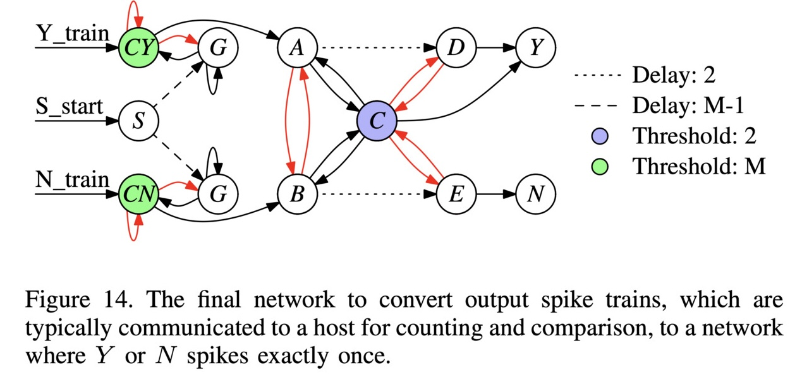

# Case Study: Network to Compare Spike Counts on Two output Neurons

This illustrates the network from the section of the paper entitled: "Case Study:
Comparing Spike Counts".

The point of this network is that many applications use spiking neural networks to make
binary decisions by counting the number of spikes on two output neurons.  Whichever neuron
spikes more is the answer to the decisions, with ties typically broken in favor of one
neuron or the other.

The problem with this methodology is communication with a host.  The most straightforward
thing to do is to have the host record the spikes, and then compare them and make the
decision.  This is a problem because communication events are expensive, certainly compared
to the speed of the neuroprocessor.

So what this network does is compare the spikes and then emit a single spike on one of two
output neurons.  This spike communicates the result of the comparison.  Although it adds
neurons, synapses and timesteps to the network, the speed of processing them is orders of
magnitude faster than communication, so the tradeoff is well worth it.  This is documented
in the paper in the classification and control applications.

The main network is in Figure 14 of the paper:



The spikes to count come in from the synapses labeled "Y_train" and "N_train", which 
correspond to a binary decision -- yes or no.  We also need to spike the S neuron at timestep
zero.

This network runs for 2M+3 timesteps and during the entirety of this running of the network
either the Y or the N neuron spikes exactly once to determine the decision.

In this markdown file (and video), we go through examples of running this network.

If you haven't done so already, I recommend going through the
[main README for this repo](../README.md), and its 
[accompanying video](X).  That will get you familiar with RISP, the open-source framework,
and how we walk through these networks.

The shell script for this network is 
`scripts/09_spike_counts.sh`.  You call it with the maximum value *M*, the value
you want to convert, and the open-source framework:

```
UNIX> echo $fro
/Users/plank/src/repos/framework-open
UNIX> sh scripts/09_Spike_Counts.sh
usage: sh scripts/st_t.sh M Y N os_framework - use -1 for Y to not run
UNIX> sh scripts/09_Spike_Counts.sh 8 2 3 $fro

# We call this with M, the maximum number of spikes to count, equal to 8.
# We set Y equal to two spikes and N equal to three spikes.
# Therefore, the comparison should result in the N neuron spiking once, and the Y neuron not spiking:

Time 0(CY)  1(S) 2(CN)  3(G)  4(G)  5(A)  6(B)  7(C)  8(D)  9(E) 10(Y) 11(N) | 0(CY)  1(S) 2(CN)  3(G)  4(G)  5(A)  6(B)  7(C)  8(D)  9(E) 10(Y) 11(N)
   0     -     *     -     -     -     -     -     -     -     -     -     - |     1     0     1     0     0     0     0     0     0     0     0     0
   1     -     -     -     -     -     -     -     -     -     -     -     - |     2     0     2     0     0     0     0     0     0     0     0     0
   2     -     -     -     -     -     -     -     -     -     -     -     - |     2     0     3     0     0     0     0     0     0     0     0     0
   3     -     -     -     -     -     -     -     -     -     -     -     - |     2     0     3     0     0     0     0     0     0     0     0     0
   4     -     -     -     -     -     -     -     -     -     -     -     - |     2     0     3     0     0     0     0     0     0     0     0     0
   5     -     -     -     -     -     -     -     -     -     -     -     - |     2     0     3     0     0     0     0     0     0     0     0     0
   6     -     -     -     -     -     -     -     -     -     -     -     - |     2     0     3     0     0     0     0     0     0     0     0     0
   7     -     -     -     *     *     -     -     -     -     -     -     - |     2     0     3     0     0     0     0     0     0     0     0     0
   8     -     -     -     *     *     -     -     -     -     -     -     - |     3     0     4     0     0     0     0     0     0     0     0     0
   9     -     -     -     *     *     -     -     -     -     -     -     - |     4     0     5     0     0     0     0     0     0     0     0     0
  10     -     -     -     *     *     -     -     -     -     -     -     - |     5     0     6     0     0     0     0     0     0     0     0     0
  11     -     -     -     *     *     -     -     -     -     -     -     - |     6     0     7     0     0     0     0     0     0     0     0     0
  12     -     -     *     *     *     -     -     -     -     -     -     - |     7     0     0     0     0     0     0     0     0     0     0     0
  13     *     -     -     *     -     -     *     -     -     -     -     - |     0     0     0     0     0     0     0     0     0     0     0     0
  14     -     -     -     -     -     -     -     -     -     -     -     - |     0     0     0     0     0     0     0     1     0     0     0     0
  15     -     -     -     -     -     -     -     -     -     *     -     - |     0     0     0     0     0     0     0     1     0     0     0     0
  16     -     -     -     -     -     -     -     -     -     -     -     * |     0     0     0     0     0     0     0     0     0     0     0     0
  17     -     -     -     -     -     -     -     -     -     -     -     - |     0     0     0     0     0     0     0     0     0     0     0     0
  18     -     -     -     -     -     -     -     -     -     -     -     - |     0     0     0     0     0     0     0     0     0     0     0     0
UNIX> sh scripts/09_Spike_Counts.sh 8 3 2 $fro

# Now we flip it, and set Y equal to 3, and N equal to 2.  
# The comparison should result in the Y neuron spiking once, and the N neuron not spiking:

Time 0(CY)  1(S) 2(CN)  3(G)  4(G)  5(A)  6(B)  7(C)  8(D)  9(E) 10(Y) 11(N) | 0(CY)  1(S) 2(CN)  3(G)  4(G)  5(A)  6(B)  7(C)  8(D)  9(E) 10(Y) 11(N)
   0     -     *     -     -     -     -     -     -     -     -     -     - |     1     0     1     0     0     0     0     0     0     0     0     0
   1     -     -     -     -     -     -     -     -     -     -     -     - |     2     0     2     0     0     0     0     0     0     0     0     0
   2     -     -     -     -     -     -     -     -     -     -     -     - |     3     0     2     0     0     0     0     0     0     0     0     0
   3     -     -     -     -     -     -     -     -     -     -     -     - |     3     0     2     0     0     0     0     0     0     0     0     0
   4     -     -     -     -     -     -     -     -     -     -     -     - |     3     0     2     0     0     0     0     0     0     0     0     0
   5     -     -     -     -     -     -     -     -     -     -     -     - |     3     0     2     0     0     0     0     0     0     0     0     0
   6     -     -     -     -     -     -     -     -     -     -     -     - |     3     0     2     0     0     0     0     0     0     0     0     0
   7     -     -     -     *     *     -     -     -     -     -     -     - |     3     0     2     0     0     0     0     0     0     0     0     0
   8     -     -     -     *     *     -     -     -     -     -     -     - |     4     0     3     0     0     0     0     0     0     0     0     0
   9     -     -     -     *     *     -     -     -     -     -     -     - |     5     0     4     0     0     0     0     0     0     0     0     0
  10     -     -     -     *     *     -     -     -     -     -     -     - |     6     0     5     0     0     0     0     0     0     0     0     0
  11     -     -     -     *     *     -     -     -     -     -     -     - |     7     0     6     0     0     0     0     0     0     0     0     0
  12     *     -     -     *     *     -     -     -     -     -     -     - |     0     0     7     0     0     0     0     0     0     0     0     0
  13     -     -     *     -     *     *     -     -     -     -     -     - |     0     0     0     0     0     0     0     0     0     0     0     0
  14     -     -     -     -     -     -     -     -     -     -     -     - |     0     0     0     0     0     0     0     1     0     0     0     0
  15     -     -     -     -     -     -     -     -     *     -     -     - |     0     0     0     0     0     0     0     1     0     0     0     0
  16     -     -     -     -     -     -     -     -     -     -     *     - |     0     0     0     0     0     0     0     0     0     0     0     0
  17     -     -     -     -     -     -     -     -     -     -     -     - |     0     0     0     0     0     0     0     0     0     0     0     0
  18     -     -     -     -     -     -     -     -     -     -     -     - |     0     0     0     0     0     0     0     0     0     0     0     0
UNIX> sh scripts/09_Spike_Counts.sh 8 0 8 $fro

# Here we're testing max and min -- Y = 0 and N = 8:

Time 0(CY)  1(S) 2(CN)  3(G)  4(G)  5(A)  6(B)  7(C)  8(D)  9(E) 10(Y) 11(N) | 0(CY)  1(S) 2(CN)  3(G)  4(G)  5(A)  6(B)  7(C)  8(D)  9(E) 10(Y) 11(N)
   0     -     *     -     -     -     -     -     -     -     -     -     - |     0     0     1     0     0     0     0     0     0     0     0     0
   1     -     -     -     -     -     -     -     -     -     -     -     - |     0     0     2     0     0     0     0     0     0     0     0     0
   2     -     -     -     -     -     -     -     -     -     -     -     - |     0     0     3     0     0     0     0     0     0     0     0     0
   3     -     -     -     -     -     -     -     -     -     -     -     - |     0     0     4     0     0     0     0     0     0     0     0     0
   4     -     -     -     -     -     -     -     -     -     -     -     - |     0     0     5     0     0     0     0     0     0     0     0     0
   5     -     -     -     -     -     -     -     -     -     -     -     - |     0     0     6     0     0     0     0     0     0     0     0     0
   6     -     -     -     -     -     -     -     -     -     -     -     - |     0     0     7     0     0     0     0     0     0     0     0     0
   7     -     -     *     *     *     -     -     -     -     -     -     - |     0     0     0     0     0     0     0     0     0     0     0     0
   8     -     -     -     *     -     -     *     -     -     -     -     - |     1     0     0     0     0     0     0     0     0     0     0     0
   9     -     -     -     *     -     -     -     -     -     -     -     - |     2     0     0     0     0    -1     0     1     0     0     0     0
  10     -     -     -     *     -     -     -     -     -     *     -     - |     3     0     0     0     0    -1     0     1     0     0     0     0
  11     -     -     -     *     -     -     -     -     -     -     -     * |     4     0     0     0     0    -1     0     0     0     0     0     0
  12     -     -     -     *     -     -     -     -     -     -     -     - |     5     0     0     0     0    -1     0     0     0     0     0     0
  13     -     -     -     *     -     -     -     -     -     -     -     - |     6     0     0     0     0    -1     0     0     0     0     0     0
  14     -     -     -     *     -     -     -     -     -     -     -     - |     7     0     0     0     0    -1     0     0     0     0     0     0
  15     *     -     -     *     -     -     -     -     -     -     -     - |     0     0     0     0     0    -1     0     0     0     0     0     0
  16     -     -     -     -     -     -     -     -     -     -     -     - |     0     0     0     0     0     0     0     0     0     0     0     0
  17     -     -     -     -     -     -     -     -     -     -     -     - |     0     0     0     0     0     0     0     0     0     0     0     0
  18     -     -     -     -     -     -     -     -     -     -     -     - |     0     0     0     0     0     0     0     0     0     0     0     0
UNIX> sh scripts/09_Spike_Counts.sh 8 8 0 $fro

# Here's the opposite: Y = 8, N = 0:

Time 0(CY)  1(S) 2(CN)  3(G)  4(G)  5(A)  6(B)  7(C)  8(D)  9(E) 10(Y) 11(N) | 0(CY)  1(S) 2(CN)  3(G)  4(G)  5(A)  6(B)  7(C)  8(D)  9(E) 10(Y) 11(N)
   0     -     *     -     -     -     -     -     -     -     -     -     - |     1     0     0     0     0     0     0     0     0     0     0     0
   1     -     -     -     -     -     -     -     -     -     -     -     - |     2     0     0     0     0     0     0     0     0     0     0     0
   2     -     -     -     -     -     -     -     -     -     -     -     - |     3     0     0     0     0     0     0     0     0     0     0     0
   3     -     -     -     -     -     -     -     -     -     -     -     - |     4     0     0     0     0     0     0     0     0     0     0     0
   4     -     -     -     -     -     -     -     -     -     -     -     - |     5     0     0     0     0     0     0     0     0     0     0     0
   5     -     -     -     -     -     -     -     -     -     -     -     - |     6     0     0     0     0     0     0     0     0     0     0     0
   6     -     -     -     -     -     -     -     -     -     -     -     - |     7     0     0     0     0     0     0     0     0     0     0     0
   7     *     -     -     *     *     -     -     -     -     -     -     - |     0     0     0     0     0     0     0     0     0     0     0     0
   8     -     -     -     -     *     *     -     -     -     -     -     - |     0     0     1     0     0     0     0     0     0     0     0     0
   9     -     -     -     -     *     -     -     -     -     -     -     - |     0     0     2     0     0     0    -1     1     0     0     0     0
  10     -     -     -     -     *     -     -     -     *     -     -     - |     0     0     3     0     0     0    -1     1     0     0     0     0
  11     -     -     -     -     *     -     -     -     -     -     *     - |     0     0     4     0     0     0    -1     0     0     0     0     0
  12     -     -     -     -     *     -     -     -     -     -     -     - |     0     0     5     0     0     0    -1     0     0     0     0     0
  13     -     -     -     -     *     -     -     -     -     -     -     - |     0     0     6     0     0     0    -1     0     0     0     0     0
  14     -     -     -     -     *     -     -     -     -     -     -     - |     0     0     7     0     0     0    -1     0     0     0     0     0
  15     -     -     *     -     *     -     -     -     -     -     -     - |     0     0     0     0     0     0    -1     0     0     0     0     0
  16     -     -     -     -     -     -     -     -     -     -     -     - |     0     0     0     0     0     0     0     0     0     0     0     0
  17     -     -     -     -     -     -     -     -     -     -     -     - |     0     0     0     0     0     0     0     0     0     0     0     0
  18     -     -     -     -     -     -     -     -     -     -     -     - |     0     0     0     0     0     0     0     0     0     0     0     0
UNIX> sh scripts/09_Spike_Counts.sh 8 3 3 $fro

# Finally, let's test ties -- Y and N equal three, and the tie is broken in favor of Y:

Time 0(CY)  1(S) 2(CN)  3(G)  4(G)  5(A)  6(B)  7(C)  8(D)  9(E) 10(Y) 11(N) | 0(CY)  1(S) 2(CN)  3(G)  4(G)  5(A)  6(B)  7(C)  8(D)  9(E) 10(Y) 11(N)
   0     -     *     -     -     -     -     -     -     -     -     -     - |     1     0     1     0     0     0     0     0     0     0     0     0
   1     -     -     -     -     -     -     -     -     -     -     -     - |     2     0     2     0     0     0     0     0     0     0     0     0
   2     -     -     -     -     -     -     -     -     -     -     -     - |     3     0     3     0     0     0     0     0     0     0     0     0
   3     -     -     -     -     -     -     -     -     -     -     -     - |     3     0     3     0     0     0     0     0     0     0     0     0
   4     -     -     -     -     -     -     -     -     -     -     -     - |     3     0     3     0     0     0     0     0     0     0     0     0
   5     -     -     -     -     -     -     -     -     -     -     -     - |     3     0     3     0     0     0     0     0     0     0     0     0
   6     -     -     -     -     -     -     -     -     -     -     -     - |     3     0     3     0     0     0     0     0     0     0     0     0
   7     -     -     -     *     *     -     -     -     -     -     -     - |     3     0     3     0     0     0     0     0     0     0     0     0
   8     -     -     -     *     *     -     -     -     -     -     -     - |     4     0     4     0     0     0     0     0     0     0     0     0
   9     -     -     -     *     *     -     -     -     -     -     -     - |     5     0     5     0     0     0     0     0     0     0     0     0
  10     -     -     -     *     *     -     -     -     -     -     -     - |     6     0     6     0     0     0     0     0     0     0     0     0
  11     -     -     -     *     *     -     -     -     -     -     -     - |     7     0     7     0     0     0     0     0     0     0     0     0
  12     *     -     *     *     *     -     -     -     -     -     -     - |     0     0     0     0     0     0     0     0     0     0     0     0
  13     -     -     -     -     -     *     *     -     -     -     -     - |     0     0     0     0     0     0     0     0     0     0     0     0
  14     -     -     -     -     -     -     -     *     -     -     -     - |     0     0     0     0     0    -1    -1     0     0     0     0     0
  15     -     -     -     -     -     -     -     -     -     -     *     - |     0     0     0     0     0     0     0     0     0     0     0     0
  16     -     -     -     -     -     -     -     -     -     -     -     - |     0     0     0     0     0     0     0     0     0     0     0     0
  17     -     -     -     -     -     -     -     -     -     -     -     - |     0     0     0     0     0     0     0     0     0     0     0     0
  18     -     -     -     -     -     -     -     -     -     -     -     - |     0     0     0     0     0     0     0     0     0     0     0     0
UNIX> sh scripts/09_Spike_Counts.sh 8 4 4 $fro

# We test ties again with both Y and N being 4:

Time 0(CY)  1(S) 2(CN)  3(G)  4(G)  5(A)  6(B)  7(C)  8(D)  9(E) 10(Y) 11(N) | 0(CY)  1(S) 2(CN)  3(G)  4(G)  5(A)  6(B)  7(C)  8(D)  9(E) 10(Y) 11(N)
   0     -     *     -     -     -     -     -     -     -     -     -     - |     1     0     1     0     0     0     0     0     0     0     0     0
   1     -     -     -     -     -     -     -     -     -     -     -     - |     2     0     2     0     0     0     0     0     0     0     0     0
   2     -     -     -     -     -     -     -     -     -     -     -     - |     3     0     3     0     0     0     0     0     0     0     0     0
   3     -     -     -     -     -     -     -     -     -     -     -     - |     4     0     4     0     0     0     0     0     0     0     0     0
   4     -     -     -     -     -     -     -     -     -     -     -     - |     4     0     4     0     0     0     0     0     0     0     0     0
   5     -     -     -     -     -     -     -     -     -     -     -     - |     4     0     4     0     0     0     0     0     0     0     0     0
   6     -     -     -     -     -     -     -     -     -     -     -     - |     4     0     4     0     0     0     0     0     0     0     0     0
   7     -     -     -     *     *     -     -     -     -     -     -     - |     4     0     4     0     0     0     0     0     0     0     0     0
   8     -     -     -     *     *     -     -     -     -     -     -     - |     5     0     5     0     0     0     0     0     0     0     0     0
   9     -     -     -     *     *     -     -     -     -     -     -     - |     6     0     6     0     0     0     0     0     0     0     0     0
  10     -     -     -     *     *     -     -     -     -     -     -     - |     7     0     7     0     0     0     0     0     0     0     0     0
  11     *     -     *     *     *     -     -     -     -     -     -     - |     0     0     0     0     0     0     0     0     0     0     0     0
  12     -     -     -     -     -     *     *     -     -     -     -     - |     0     0     0     0     0     0     0     0     0     0     0     0
  13     -     -     -     -     -     -     -     *     -     -     -     - |     0     0     0     0     0    -1    -1     0     0     0     0     0
  14     -     -     -     -     -     -     -     -     -     -     *     - |     0     0     0     0     0     0     0     0     0     0     0     0
  15     -     -     -     -     -     -     -     -     -     -     -     - |     0     0     0     0     0     0     0     0     0     0     0     0
  16     -     -     -     -     -     -     -     -     -     -     -     - |     0     0     0     0     0     0     0     0     0     0     0     0
  17     -     -     -     -     -     -     -     -     -     -     -     - |     0     0     0     0     0     0     0     0     0     0     0     0
  18     -     -     -     -     -     -     -     -     -     -     -     - |     0     0     0     0     0     0     0     0     0     0     0     0
UNIX> 
```


Let's take a look at the network.  See how it matches the picture above:

```
UNIX> ( echo FJ tmp_network.txt ; echo SORT Q ; echo TJ ) | $fro/bin/network_tool
{ "Properties":
  { "node_properties": [
      { "name":"Threshold", "type":73, "index":0, "size":1, "min_value":0.0, "max_value":8.0 }],
    "edge_properties": [
      { "name":"Delay", "type":73, "index":1, "size":1, "min_value":1.0, "max_value":8.0 },
      { "name":"Weight", "type":73, "index":0, "size":1, "min_value":-8.0, "max_value":8.0 }],
    "network_properties": [] },
 "Nodes":
  [ {"id":0,"name":"CY","values":[8.0]},
    {"id":1,"name":"S","values":[1.0]},
    {"id":2,"name":"CN","values":[8.0]},
    {"id":3,"name":"G","values":[1.0]},
    {"id":4,"name":"G","values":[1.0]},
    {"id":5,"name":"A","values":[1.0]},
    {"id":6,"name":"B","values":[1.0]},
    {"id":7,"name":"C","values":[2.0]},
    {"id":8,"name":"D","values":[1.0]},
    {"id":9,"name":"E","values":[1.0]},
    {"id":10,"name":"Y","values":[1.0]},
    {"id":11,"name":"N","values":[1.0]} ],
 "Edges":
  [ {"from":0,"to":0,"values":[-1.0,1.0]},
    {"from":0,"to":3,"values":[-1.0,1.0]},
    {"from":0,"to":5,"values":[1.0,1.0]},
    {"from":1,"to":3,"values":[1.0,7.0]},
    {"from":1,"to":4,"values":[1.0,7.0]},
    {"from":2,"to":2,"values":[-1.0,1.0]},
    {"from":2,"to":4,"values":[-1.0,1.0]},
    {"from":2,"to":6,"values":[1.0,1.0]},
    {"from":3,"to":0,"values":[1.0,1.0]},
    {"from":3,"to":3,"values":[1.0,1.0]},
    {"from":4,"to":2,"values":[1.0,1.0]},
    {"from":4,"to":4,"values":[1.0,1.0]},
    {"from":5,"to":6,"values":[-1.0,1.0]},
    {"from":5,"to":7,"values":[1.0,1.0]},
    {"from":5,"to":8,"values":[1.0,2.0]},
    {"from":6,"to":5,"values":[-1.0,1.0]},
    {"from":6,"to":7,"values":[1.0,1.0]},
    {"from":6,"to":9,"values":[1.0,2.0]},
    {"from":7,"to":5,"values":[1.0,1.0]},
    {"from":7,"to":6,"values":[1.0,1.0]},
    {"from":7,"to":8,"values":[-1.0,1.0]},
    {"from":7,"to":9,"values":[-1.0,1.0]},
    {"from":7,"to":10,"values":[1.0,1.0]},
    {"from":8,"to":7,"values":[-1.0,1.0]},
    {"from":8,"to":10,"values":[1.0,1.0]},
    {"from":9,"to":7,"values":[-1.0,1.0]},
    {"from":9,"to":11,"values":[1.0,1.0]} ],
 "Inputs": [0,1,2],
 "Outputs": [10,11],
 "Network_Values": [],
 "Associated_Data":
   { "other": {"proc_name":"risp"},
     "proc_params": 
      { "discrete": true,
        "fire_like_ravens": false,
        "leak_mode": "none",
        "max_delay": 8,
        "max_threshold": 8.0,
        "max_weight": 8.0,
        "min_potential": -8.0,
        "min_threshold": 0.0,
        "min_weight": -8.0,
        "run_time_inclusive": false,
        "spike_value_factor": 8.0,
        "threshold_inclusive": true}}}
UNIX> 
```

Finally, let's take a look at the processor_tool commands when Y equals 3 and N equals 2

```
UNIX> sh scripts/09_Spike_Counts.sh 8 3 2 $fro > /dev/null
UNIX> cat tmp_pt_input.txt 
ML tmp_network.txt
ASV 0 0 1                   # We apply three inputs with values of 1 to the CY neuron.
ASV 0 1 1                   # These can arrive any time within the first 8 timesteps.
ASV 0 2 1
ASV 2 0 1                   # We apply two inputs with values of 1 to the CN neuron.
ASV 2 1 1
ASV 1 0 1                   # We make S spike once.
RSC 19                      # Run it for 19 timesteps and see which of Y or N spikes:
UNIX> $fro/bin/processor_tool_risp < tmp_pt_input.txt 
Time 0(CY)  1(S) 2(CN)  3(G)  4(G)  5(A)  6(B)  7(C)  8(D)  9(E) 10(Y) 11(N) | 0(CY)  1(S) 2(CN)  3(G)  4(G)  5(A)  6(B)  7(C)  8(D)  9(E) 10(Y) 11(N)
   0     -     *     -     -     -     -     -     -     -     -     -     - |     1     0     1     0     0     0     0     0     0     0     0     0
   1     -     -     -     -     -     -     -     -     -     -     -     - |     2     0     2     0     0     0     0     0     0     0     0     0
   2     -     -     -     -     -     -     -     -     -     -     -     - |     3     0     2     0     0     0     0     0     0     0     0     0
   3     -     -     -     -     -     -     -     -     -     -     -     - |     3     0     2     0     0     0     0     0     0     0     0     0
   4     -     -     -     -     -     -     -     -     -     -     -     - |     3     0     2     0     0     0     0     0     0     0     0     0
   5     -     -     -     -     -     -     -     -     -     -     -     - |     3     0     2     0     0     0     0     0     0     0     0     0
   6     -     -     -     -     -     -     -     -     -     -     -     - |     3     0     2     0     0     0     0     0     0     0     0     0
   7     -     -     -     *     *     -     -     -     -     -     -     - |     3     0     2     0     0     0     0     0     0     0     0     0
   8     -     -     -     *     *     -     -     -     -     -     -     - |     4     0     3     0     0     0     0     0     0     0     0     0
   9     -     -     -     *     *     -     -     -     -     -     -     - |     5     0     4     0     0     0     0     0     0     0     0     0
  10     -     -     -     *     *     -     -     -     -     -     -     - |     6     0     5     0     0     0     0     0     0     0     0     0
  11     -     -     -     *     *     -     -     -     -     -     -     - |     7     0     6     0     0     0     0     0     0     0     0     0
  12     *     -     -     *     *     -     -     -     -     -     -     - |     0     0     7     0     0     0     0     0     0     0     0     0
  13     -     -     *     -     *     *     -     -     -     -     -     - |     0     0     0     0     0     0     0     0     0     0     0     0
  14     -     -     -     -     -     -     -     -     -     -     -     - |     0     0     0     0     0     0     0     1     0     0     0     0
  15     -     -     -     -     -     -     -     -     *     -     -     - |     0     0     0     0     0     0     0     1     0     0     0     0
  16     -     -     -     -     -     -     -     -     -     -     *     - |     0     0     0     0     0     0     0     0     0     0     0     0
  17     -     -     -     -     -     -     -     -     -     -     -     - |     0     0     0     0     0     0     0     0     0     0     0     0
  18     -     -     -     -     -     -     -     -     -     -     -     - |     0     0     0     0     0     0     0     0     0     0     0     0
UNIX> 
```
