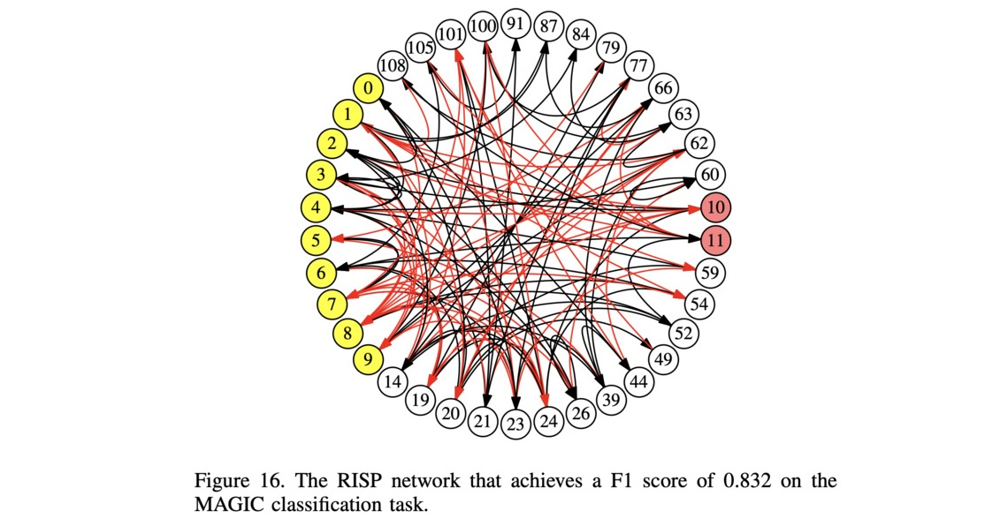
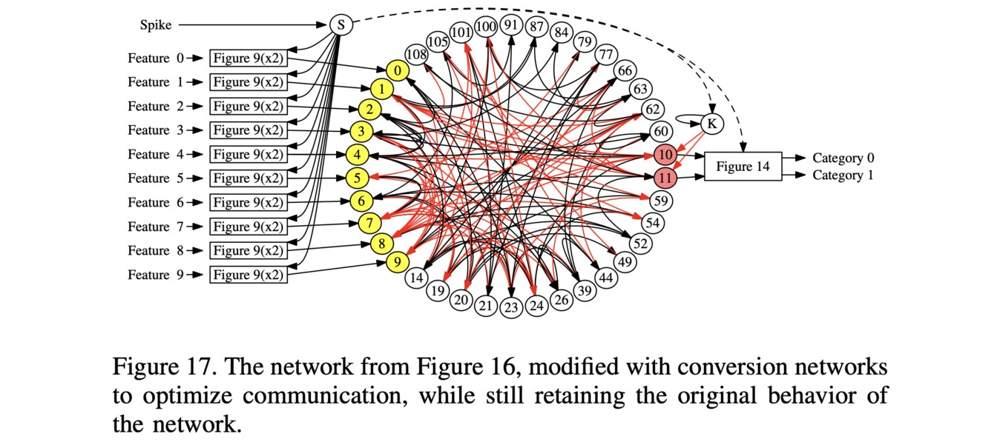
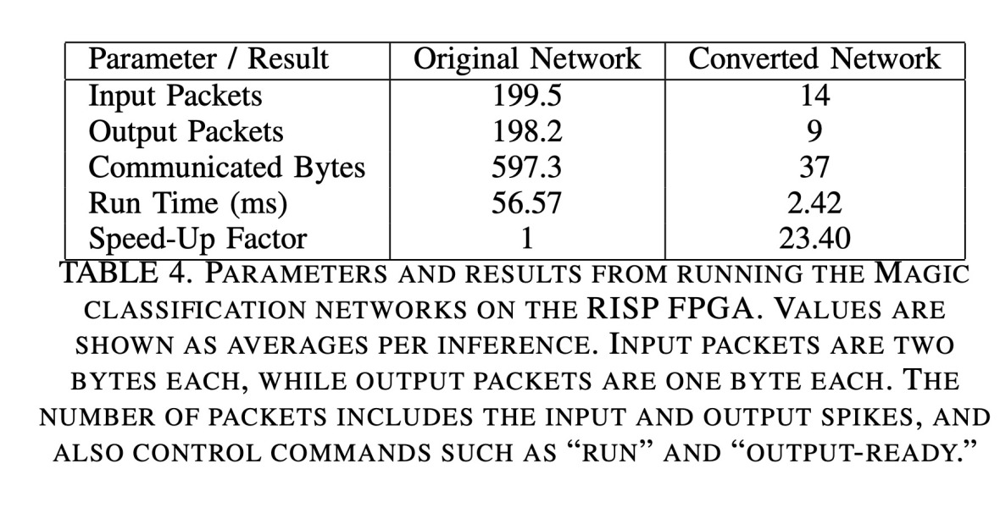

# Experiment: Classification/Inference with the Magic Dataset

The video for this markdown file is in [https://youtu.be/Qe6yHSXFBVc](https://youtu.be/Qe6yHSXFBVc).

-----------

If you haven't done so already, I recommend going through the
[main README for this repo](../README.md), and its
[accompanying video](https://youtu.be/shubU9zfBAA).  That will get you familiar with RISP, the open-source framework,
and how we walk through these networks.

-----------


This illustrates the network from the section of the paper entitled: "Experiment:
Inference with the Magic Dataset."

The MAGIC dataset, which you can get from
[https://archive.ics.uci.edu/dataset/159/magic+gamma+telescope](https://archive.ics.uci.edu/dataset/159/magic+gamma+telescope), has 10 features, 19020 observations, and two categories.
We partitioned this dataset into a training set with 10032 observations and a testing
dataset with 3344 observations.  Yes, 10032+3344 does not equal 19020, but that is because
there were not an equal number of observations in each category.  So our smaller datasets
do have an equal number of observations in each category.

We trained a network, which is in
[networks/magic_original_network.txt](networks/magic_original_network.txt) that gets
an F1 score of 0.832 on the testing dataset.
To use this network, you need to convert the features into spikes.  I have done that
in the file [pt_inputs/magic_original.txt](pt_inputs/magic_original.txt), which has
processor_tool commands to run the network.  In the comments of this file, I have
the observations, how they are converted into spikes, the number of output spikes on the
two output neurons, and the classification decision.
You can see those by grepping for the word "Step" in that file.  Here are the first 5
observations:

```
UNIX> grep Step pt_inputs/magic_original.txt | head -n 20
# Step 0000. Observations: 25.5169 7.0857 2.4082 0.668 0.4121 9.0383 9.5293 5.747 11.804 191.668
# Step 0000. I-Spike-C: 4 2 7 36 30 22 29 27 7 19
# Step 0000. O-Spike-C: 40 42
# Step 0000. Action: 1
# Step 0001. Observations: 18.142 10.6907 2.3324 0.5442 0.286 -0.7682 6.0744 4.7684 42.849 175.7
# Step 0001. I-Spike-C: 3 3 6 29 21 22 29 27 23 17
# Step 0001. O-Spike-C: 77 72
# Step 0001. Action: 0
# Step 0002. Observations: 37.7828 17.0539 2.6253 0.3436 0.1813 16.8376 29.6012 -10.3231 16.5441 227.715
# Step 0002. I-Spike-C: 5 4 10 19 13 23 31 25 9 22
# Step 0002. O-Spike-C: 49 43
# Step 0002. Action: 0
# Step 0003. Observations: 31.1816 19.884 2.7672 0.3402 0.1735 13.1058 24.1669 -18.1463 35.4229 140.242
# Step 0003. I-Spike-C: 4 4 12 18 13 22 30 24 19 14
# Step 0003. O-Spike-C: 41 41
# Step 0003. Action: 0
# Step 0004. Observations: 82.5121 32.6518 3.541 0.1332 0.0678 96.6872 71.9971 30.0261 2.123 252.681
# Step 0004. I-Spike-C: 12 7 23 7 5 26 34 30 2 25
# Step 0004. O-Spike-C: 55 50
# Step 0004. Action: 0
UNIX>
```

I'm not going to go into great detail on how the observations are converted into spikes, but
I'll go over a few examples so you get the gist.  In the magic dataset, the ranges of the
10 features are as follows:

- Feature 0: 4.2835 - 334.177
- Feature 1: 0.0 - 256.382
- Feature 2: 1.9413 - 5.3233
- Feature 3: 0.0131 - 0.893
- Feature 4: 0.0003 - 0.6752
- Feature 5: -457.9161 - 575.2407
- Feature 6: -331.78 - 238.321
- Feature 7: -205.8947 - 179.851
- Feature 8: 0.0 - 90.0
- Feature 9: 1.2826 - 495.561

We are converting each feature into a number of spikes from 1 to 48.  So, consider
the first observation, whose first feature is 25.5169.  Let's convert that to a number
between 0 and 48 using the range [4.2835, 334.177]:

48 * (25.5169 - 4.2835) / (334.177-4.2835) = 3.089492

We convert that to a number of spikes by taking its ceiling -- therefore, it corresponds
to four spikes.    I'll do one more example.  The last feature of the first
observation is 191.668, and its range is [1.2826, 495.561].  So:

48 * (191.668 - 1.2826) / (495.561-1.2826) = 18.488567

The ceiling of that is 19, which corresponds to 19 spikes.  If you look at the spike
count of the first observation, you'll see that the first feature has 4 spikes, and
the last has 19.  So it all makes sense!

```
# Step 0000. I-Spike-C: 4 2 7 36 30 22 29 27 7 19
```

The original magic network is shown in Figure 16 of the paper:



We can run it using the processor_tool input in `pt_inputs/magic_original.txt`.  Let's
look at that briefly:

```
UNIX> head -n 20 pt_inputs/magic_original.txt
ML networks/magic_original_network.txt
# Step 0000. Observations: 25.5169 7.0857 2.4082 0.668 0.4121 9.0383 9.5293 5.747 11.804 191.668
CLEAR-A
# Step 0000. I-Spike-C: 4 2 7 36 30 22 29 27 7 19
AS 0 0 1
AS 0 2 1
AS 0 4 1
AS 0 6 1
AS 1 0 1
AS 1 2 1
AS 2 0 1
AS 2 2 1
AS 2 4 1
AS 2 6 1
AS 2 8 1
AS 2 10 1
AS 2 12 1
AS 3 0 1
AS 3 2 1
AS 3 4 1
UNIX>
```

As you can see, it loads the network, and then does the 'AS' commands to spike the inputs
the appropriate number of times, once every two timesteps.  After those commands, we RUN
for 128 timesteps, and then do OC to see the counts of spikes on the output neurons:

```
# See where the first RUN command is:
UNIX> cat -n pt_inputs/magic_original.txt  | grep RUN | head -n 1
   188	RUN 128
# Print out lines 185-195 to see the end of the apply spikes, the RUN and OC, commands,
# the number of output spikes that should occur, and the action.   You then see the
# beginning of the next observation:
UNIX> sed -n 185,195p pt_inputs/magic_original.txt
AS 9 32 1
AS 9 34 1
AS 9 36 1
RUN 128
OC
# Step 0000. O-Spike-C: 40 42
# Step 0000. Action: 1
# Step 0001. Observations: 18.142 10.6907 2.3324 0.5442 0.286 -0.7682 6.0744 4.7684 42.849 175.7
CLEAR-A
# Step 0001. I-Spike-C: 3 3 6 29 21 22 29 27 23 17
AS 0 0 1
UNIX>
```

Let's print out the first 2 lines of output.  As you can see, the output counts
match what's in the comments to the input file.

```
UNIX> $fro/bin/processor_tool_risp < pt_inputs/magic_original.txt | head -n 10
node 10 spike counts: 40
node 11 spike counts: 42
UNIX>
```

Let's run the last 5 observations and make sure they match:

```
UNIX> $fro/bin/processor_tool_risp < pt_inputs/magic_original.txt | tail -n 10
node 10 spike counts: 44
node 11 spike counts: 44
node 10 spike counts: 11
node 11 spike counts: 66
node 10 spike counts: 48
node 11 spike counts: 58
node 10 spike counts: 27
node 11 spike counts: 63
node 10 spike counts: 58
node 11 spike counts: 60
UNIX> grep O-Spike-C pt_inputs/magic_original.txt | tail -n 5
# Step 3339. O-Spike-C: 44 44
# Step 3340. O-Spike-C: 11 66
# Step 3341. O-Spike-C: 48 58
# Step 3342. O-Spike-C: 27 63
# Step 3343. O-Spike-C: 58 60
UNIX>
```

----------------
## The converted network

Now, the converted network looks as in Figure 17 of the paper:



I have this network in file
[networks/magic_converted.txt](networks/magic_converted.txt).
You can see that it's bigger than the original, and it has one more input, the S neuron:

```
UNIX> ( echo FJ networks/magic_original_network.txt ; echo INFO ) | $fro/bin/network_tool | sed '/Hidden/d'
Nodes:         38
Edges:        120
Inputs:        10
Outputs:        2

Input nodes:  0 1 2 3 4 5 6 7 8 9
Output nodes: 10 11
UNIX> ( echo FJ networks/magic_converted.txt ; echo INFO ) | $fro/bin/network_tool | sed '/Hidden/d'
Nodes:        102
Edges:        304
Inputs:        11
Outputs:        2

Input nodes:  109(S) 110(CTime-0) 115(CTime-1) 120(CTime-2) 125(CTime-3) 130(CTime-4) 135(CTime-5) 140(CTime-6) 145(CTime-7) 150(CTime-8) 155(CTime-9)
Output nodes: 172(y) 173(n)
UNIX>
```

I have converted the processor_tool input from
`pt_inputs/magic_original.txt` to work with this network.  It is in
[pt_inputs/magic_converted_pt.txt](pt_inputs/magic_converted_pt.txt).  Let's look and
see how it processes the first observation:

```
UNIX> head -n 15 pt_inputs/magic_converted_pt.txt
ML networks/magic_converted.txt
CLEAR-A
AS 109 0 1
ASV 110 0 4
ASV 115 0 2
ASV 120 0 7
ASV 125 0 36
ASV 130 0 30
ASV 135 0 22
ASV 140 0 29
ASV 145 0 27
ASV 150 0 7
ASV 155 0 19
RUN 361
OC
UNIX>
```

You can see a few differences here from `pt_inputs/magic_original.txt`:

- We add an AS command to make the S neuron spike at timestep 0.
- The spike trains have now been converted to ASV calls, where the number of spikes
  have been changed to values.  For example, the first and last feature previously
  spiked neuron 0 four times, and neuron 9 19 times.  Now we send a value of 4 to
  neuron 110, which corresponds to the first feature.  Similarly, we send a value of 19
  to neuron 155, which corresponds to the last feature.
- We run for 361 timesteps instead of 128.  That allows time to turn the input values into
  spike trains, and to process the outputs on neurons 10 and 11 so that they are counted,
  compared, and turned into a single spike on neuron 172 or 173.

Let's run this for the first observation:

```
UNIX> head -n 15 pt_inputs/magic_converted_pt.txt | $fro/bin/processor_tool_risp
node 172(y) spike counts: 0
node 173(n) spike counts: 1
UNIX>
```

That matches -- our previous network had 40 spikes on node 10 and 42 on node 11, which
corresponds to a "N".  Let's show that nodes 10 and 11 spiked the correct number
of times.  To do that, I'm going to use the `network_tool` to add nodes 10 and 11 as
output nodes, and save the resulting network to `tmp_network.txt`:

```
UNIX> ( echo FJ networks/magic_converted.txt ; echo AO 10 11 ; echo TJ tmp_network.txt ) | $fro/bin/network_tool
```

And I'll isolate the first 15 lines of the processor tool input, but change the network
to `tmp_network.txt`:

```
UNIX> head -n 15 pt_inputs/magic_converted_pt.txt | sed 's/ML.*/ML tmp_network.txt/' >  tmp_pt_input.txt
```

Finally, I'll run `tmp_pt_input.txt` in the processor_tool -- that way we can see the
spike counts on neurons 10 and 11:

```
UNIX> $fro/bin/processor_tool_risp < tmp_pt_input.txt
node 172(y) spike counts: 0
node 173(n) spike counts: 1
node 10 spike counts: 40
node 11 spike counts: 42
UNIX>
```

They match!

Let's just confirm to ourselves that the input is being converted correctly.

To do that, let's look at the spike raster output of inputs 0 and 9 in the original
network, when it's processing the first observation.  We'll change the OC commands
to GSR 0 9 and just look at the outputs of the first RUN call:

```
UNIX> sed 's/OC/GSR 0 9/' < pt_inputs/magic_original.txt | $fro/bin/processor_tool_risp | head -n 2
0   INPUT  : 10111111010101010000000000000000000000000000000000000000000000000000000000000000000000000000000000010101010101010101010101010101
9   INPUT  : 10000010000000001000100010001000100010000000000000000000000000000000000000000000000000000000000000000000000000000000000000000000
UNIX>
```

Now, let's do the same thing with the converted network:

```
UNIX> sed 's/OC/GSR 0 9/' < pt_inputs/magic_converted_pt.txt | $fro/bin/processor_tool_risp | head -n 2
0             HIDDEN : 0000000000000000000000000000000000000000000000000000000000000000000000000000000000000000000000000000000101111110101010100000000000000000000000000000000000000000000000000000000000000000000000000000000000101010101010101010101010101010101000000000000000000000000000000000000000000000000000000000000000000000000000000000000000000000000000000000000000000000000000000
9             HIDDEN : 0000000000000000000000000000000000000000000000000000000000000000000000000000000000000000000000000000000100000100000000010001000100010001000100000000000000000000000000000000000000000000000000000000000000000000000000000000000000000000000000000000000000000000000000000000000000000000000000000000000000000000000000000000000000000000000000000000000000000000000000000
UNIX>
```

Remember, we run the converted network for 361 timesteps instead of 128, and the input spikes
start to arrive at the original input neurons at timestep 103.  And of course, we run it
for extra timesteps.  So at a first glance, these look good.
To convince ourselves, we should instead isolate the 128 spikes starting at timestep 103,
and make sure they match.  I do that in the video, but it's too cumbersome to put here.
Suffice it to say that it works.

As a final test -- let's make sure that both networks produce the same classifications
on all of the inputs.  For the original network, let's just use the "Action" lines:

```
UNIX> grep Action pt_inputs/magic_original.txt | head
# Step 0000. Action: 1
# Step 0001. Action: 0
# Step 0002. Action: 0
# Step 0003. Action: 0
# Step 0004. Action: 0
# Step 0005. Action: 0
# Step 0006. Action: 0
# Step 0007. Action: 0
# Step 0008. Action: 0
# Step 0009. Action: 1
UNIX>
```

Get rid of everything but the last character:

```
UNIX> grep Action pt_inputs/magic_original.txt | sed 's/.* //' > tmp_orig.txt
UNIX> head tmp_orig.txt
1
0
0
0
0
0
0
0
0
1
UNIX> 
```

Now run the converted network and put the output into `tmp_conv.txt`:

```
UNIX> $fro/bin/processor_tool_risp < pt_inputs/magic_converted_pt.txt > tmp_conv.txt
UNIX> head !$
node 172(y) spike counts: 0
node 173(n) spike counts: 1
node 172(y) spike counts: 1
node 173(n) spike counts: 0
node 172(y) spike counts: 1
node 173(n) spike counts: 0
node 172(y) spike counts: 1
node 173(n) spike counts: 0
node 172(y) spike counts: 1
node 173(n) spike counts: 0
UNIX> 
```

Now, let's isolate the lines that end with 1, and then change the lines with 172 to 0
and the lines with 173 to 1:

```
UNIX> grep '1$' < tmp_conv.txt | sed 's/.*172.*/0/' | sed 's/.*173.*/1/' > tmp_conv_2.txt
UNIX> head !$
head tmp_conv_2.txt
1
0
0
0
0
0
0
0
0
1
UNIX>
```

When we compare this last file to the one we created from the original, they match exactly!

```
UNIX> diff tmp_conv_2.txt tmp_orig.txt
```

---------------
## Performance Results

These are communicated in the paper, but I'll replicate them here.  The neuroprocessor is
running on a Basys 3 Artix-7 FPGA board, that has been configured with the 
[RISP Open-Source FPGA](https://github.com/TENNLab-UTK/fpga) 
to run the two classification networks.   The host is a Raspberry Pi RP2040 Pico
microcontroller communicating with the FPGA over Uart.  Here are the performance results
of performing classification on the 3343 testing observations (this is Table 4 in the paper).



As you can see, the setup, which is not atypical for embedded neuromorphic systems, penalizes
communication heavily.  Therefore, the converted network shows a massive improvement of 23.4x
in speed.

Now, you may be thinking, "Can't we just change the communication to do better buffering or
to aggregate inputs and outputs?"  That's a great thought, and it would indeed improve the
performance of the original.  However, having the network improve the communication puts less
burden on the neuroprocessor, and often users do not have the ability to modify the neuroprocessor.
So this is a nice way to improve performance.
