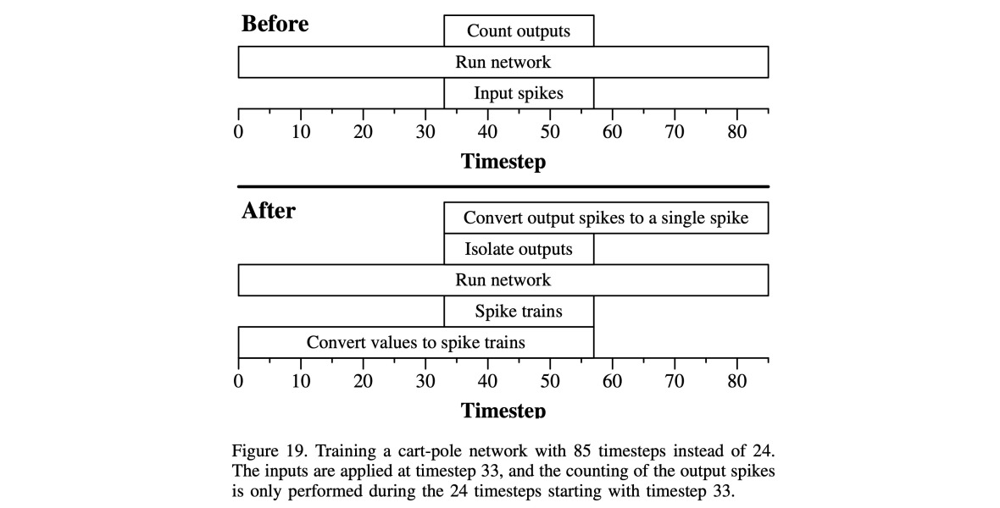

# Experiment: Control with the Cart-Pole Application

This illustrates the network from the section of the paper entitled: "Experiment:
Control with the Cart-Pole Application."

For this (hard) version of the cart-pole problem, we only give the agent two observations -- the
x location of the cart, and the theta angle of the pole.  The agent has two actions: 0
means push the cart left and 1 means push the cart right.

The network that we trained to solve this problem is in Figure 20 of the paper:


This is also in the file.
[networks/pole_original.txt](networks/pole_original.txt).

This network encodes the two inputs with an "argyle" encoder, which uses four input neurons
per input.  It takes each input value
and turns it into 9 spikes applied to two of the four input neurons.
Let's show
an example from an example run, whose processor_tool commands are in
[pt_inputs/pole_original.txt](pt_inputs/pole_original.txt).   This file was generated by
our closed-source cart-pole application, and embedded in the input is information about
the observations, actions and encodings.  That information is commented out, so it is not
passed to the processor_tool.  However, it lets us interpret what's going on.

Here is information
about the first five observations:

```
UNIX> grep Step pt_inputs/pole_original.txt | head -n 20
# Step 0000. Observations: -0.549468 0.102954
# Step 0000. I-Spike-C: 0 7 2 0 0 0 7 2
# Step 0000. O-Spike-C: 0 7
# Step 0000. Action: 1
# Step 0001. Observations: -0.547216 0.105838
# Step 0001. I-Spike-C: 0 7 2 0 0 0 6 3
# Step 0001. O-Spike-C: 5 6
# Step 0001. Action: 1
# Step 0002. Observations: -0.541094 0.103553
# Step 0002. I-Spike-C: 0 7 2 0 0 0 7 2
# Step 0002. O-Spike-C: 5 7
# Step 0002. Action: 1
# Step 0003. Observations: -0.531102 0.0961189
# Step 0003. I-Spike-C: 0 7 2 0 0 0 7 2
# Step 0003. O-Spike-C: 5 7
# Step 0003. Action: 1
# Step 0004. Observations: -0.517241 0.0835187
# Step 0004. I-Spike-C: 0 7 2 0 0 0 8 1
# Step 0004. O-Spike-C: 5 8
# Step 0004. Action: 1
UNIX> 
```

As you can see, the x observation, which is between -0.517241 and -0.549468, gets encoded
in the same way in all five observations: 7 spikes to neuron x1 and 2 to neuron x2.
The theta value starts at 0.102954, goes up to 0.105838 at observation 1, and then
descends down to 0.0835187.  As such, we have the following input spikes:

- Observations 0, 2 and 3: 7 spikes to t2 and 2 to t3.
- Observation 1: 6 spikes to t2 and 3 to t3
- Observation 4: 8 spikes to t2 and 1 to t3

You can see the output spikes as well, and in each case, the count of the second is bigger
than the count of the first.  So the action in all cases is "push right".

Let's look a little more at that input file.  Here's everything for the first observation:

```
UNIX> head -n 27 pt_inputs/pole_original.txt
ML networks/pole_original.txt
# Step 0000. Observations: -0.549468 0.102954
RUN 33
# Step 0000. I-Spike-C: 0 7 2 0 0 0 7 2
AS 1 0 1
AS 1 3 1
AS 1 6 1
AS 1 9 1
AS 1 12 1
AS 1 15 1
AS 1 18 1
AS 2 0 1
AS 2 3 1
AS 6 0 1
AS 6 3 1
AS 6 6 1
AS 6 9 1
AS 6 12 1
AS 6 15 1
AS 6 18 1
AS 7 0 1
AS 7 3 1
RUN 24
OC
# Step 0000. O-Spike-C: 0 7
RUN 28
# Step 0000. Action: 1
UNIX>
```

It's pretty easy to see how the spikes are applied.
What might be a little confusing is that there are three run calls for each
observation:

- 33 timesteps before the inputs are applied
- 24 timesteps for the input, and that is also the time when the outputs are counted.
- 28 more timesteps 

The reason we use three run calls is described in the paper -- we are going to add conversion
networks to encode the input and decode the output.  Those networks take extra time before
and after the processing of the original network.  When we did classification, we could
simply add the time before and after, because we clear the network after each observation.
In this application, however, we don't clear the network, because the agent needs memory.
So what we do instead is train this network using the extra run calls, and that will allow
us to add the conversion networks without altering how the SNN computes.

Let's run the first observation:

```
UNIX> head -n 27 pt_inputs/pole_original.txt | $fro/bin/processor_tool_risp
node 8 spike counts: 0
node 9 spike counts: 7
UNIX> 
```

As you can see, it matches the "O-Spike_C" line.  That will be true for every observation.

Now, the converted network is in Figure 22 of the paper:


It has been set up so that the observations are received as values, and they are converted
to spike trains that go into the original networks by the "Figure 9(3x)" subnetwork.
The subnetwork labeled "Figure 21"
isolates the spikes on L and R from timesteps 33 through 56, and then the subnetwork
labeled Figure 14 counts them and compares them.  

Figure 19 illustrates the process graphically:



This network is in [networks/pole_converted.txt](networks/pole_converted.txt).
Let's identify the inputs and outputs:

```
UNIX> ( echo FJ networks/pole_converted.txt ; echo INFO ) | $fro/bin/network_tool | grep Input
Inputs:         9
Input nodes:  91(S) 92(CTime-0) 97(CTime-1) 102(CTime-2) 107(CTime-3) 112(CTime-4) 117(CTime-5) 122(CTime-6) 127(CTime-7) 
UNIX> ( echo FJ networks/pole_converted.txt ; echo INFO ) | $fro/bin/network_tool | grep Output
Outputs:        2
Output nodes: 147(L) 148(R) 
UNIX> 
```

The input neurons are now 91 (S), and then 92, 97, 102, 107 for x0 through x3, and
112, 117, 122 and 127 for t0 through t3.  The outputs are 147 and 148, for "push-left"
and "push-right", and whereas before we counted spikes on the output neurons, here there
will be a single spike on either "push-left" or "push-right"

The processor_tool input for this is in 
[pt_inputs/pole_converted_pt.txt](pt_inputs/pole_converted_pt.txt).  Let's look at the first
observation:

```
UNIX> head -n 8 pt_inputs/pole_converted_pt.txt
ML networks/pole_converted.txt
AS 91 0 1
ASV 97 0 7
ASV 102 0 2
ASV 122 0 7
ASV 127 0 2
RUN 85
OC
UNIX> 
```

So, in the original input, we applied 7 spikes to
x1, 2 to x2, 7 to t2 and 2 to t3.  Here we apply those values to the inputs rather than
spike trains.  We also apply a single spike to S.

We do a single run call for 85 timesteps rather than the three run calls (which summed to 85).
And then we look at the counts on the outputs.  As I said above, there will be a single
spike on one of the outputs.

Let's run this first observation:

```
UNIX> head -n 8 pt_inputs/pole_converted_pt.txt | $fro/bin/processor_tool_risp
node 147(L) spike counts: 0
node 148(R) spike counts: 1
UNIX> 
```

As promised, there was a single output spike, on "push-right".  That matches the original
output, where the spike counts were 0 and 7, corresponding to "push-right."

We can put some effort into seeing how the spike rasters line up, which I'll probably do in
the video.  What I'll do here is show that the actions of the two networks are exactly the
same.  First, let's isolate the "Action" lines from the original input file:

```
UNIX> grep Action pt_inputs/pole_original.txt | head        # The first 10 action lines
# Step 0000. Action: 1
# Step 0001. Action: 1
# Step 0002. Action: 1
# Step 0003. Action: 1
# Step 0004. Action: 1
# Step 0005. Action: 1
# Step 0006. Action: 0
# Step 0007. Action: 0
# Step 0008. Action: 0
# Step 0009. Action: 0
UNIX> grep Action pt_inputs/pole_original.txt | sed 's/.* //' | head    # The actions themselves (0=L, 1=R)
1
1
1
1
1
1
0
0
0
0
UNIX> grep Action pt_inputs/pole_original.txt | sed 's/.* //' > tmp_orig.txt   # Put them all into a file.
UNIX> wc tmp_orig.txt                     # As you can see, there are 15001 of them.
   15001   15001   30002 tmp_orig.txt
UNIX> 
```

Next, let's run the converted network, and isolate the actions:

```
UNIX> $fro/bin/processor_tool_risp < pt_inputs/pole_converted_pt.txt | head       # Here's what the output looks like:
node 147(L) spike counts: 0
node 148(R) spike counts: 1
node 147(L) spike counts: 0
node 148(R) spike counts: 1
node 147(L) spike counts: 0
node 148(R) spike counts: 1
node 147(L) spike counts: 0
node 148(R) spike counts: 1
node 147(L) spike counts: 0
node 148(R) spike counts: 1
UNIX> $fro/bin/processor_tool_risp < pt_inputs/pole_converted_pt.txt | grep ': 1' | head         # Isolate the outputs that spike.
node 148(R) spike counts: 1
node 148(R) spike counts: 1
node 148(R) spike counts: 1
node 148(R) spike counts: 1
node 148(R) spike counts: 1
node 148(R) spike counts: 1
node 147(L) spike counts: 1
node 147(L) spike counts: 1
node 147(L) spike counts: 1
node 147(L) spike counts: 1
UNIX> $fro/bin/processor_tool_risp < pt_inputs/pole_converted_pt.txt | grep ': 1' | sed 's/.*147.*/0/' | sed 's/.*148.*/1/' | head
      # Change the spikes on 147 to 0's, and the spikes on 148 to 1's.
1
1
1
1
1
1
0
0
0
0
      # Put all of those into tmp_converted.txt
UNIX> $fro/bin/processor_tool_risp < pt_inputs/pole_converted_pt.txt | grep ': 1' | sed 's/.*147.*/0/' | sed 's/.*148.*/1/' > tmp_converted.txt
UNIX> wc tmp_converted.txt
   15001   15001   30002 tmp_converted.txt
UNIX> 
```

Now, the two action files should be identical, and they are!

```
UNIX> diff tmp_orig.txt tmp_converted.txt 
UNIX> 
```

