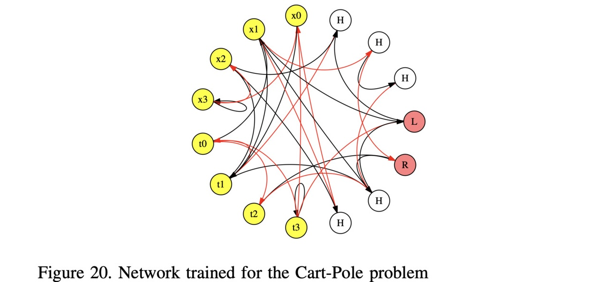
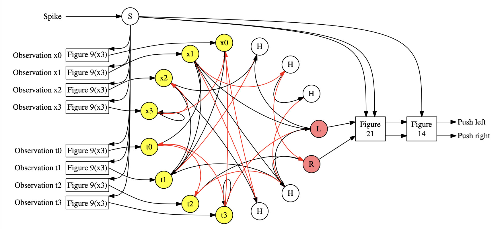

# Experiment: Control with the Cart-Pole Application

This illustrates the network from the section of the paper entitled: "Experiment:
Control with the Cart-Pole Application."

For this (hard) version of the cart-pole problem, we only give the agent two observations -- the
x location of the cart, and the theta angle of the pole.  The agent has two actions: 0
means push the cart left and 1 means push the cart right.

The network that we trained to solve this problem is in Figure 20 of the paper:



This is also in the file.
[networks/pole_original.txt](networks/pole_original.txt).

This network encodes the two inputs with an "argyle" encoder, which uses four input neurons
per input.  It takes each input value
and turns it into 9 spikes applied to two of the four input neurons.  Let's show
an example from an example run, whose processor_tool commands are in
[pt_inputs/pole_original.txt](pt_inputs/pole_original.txt).  Here is information
about the first five observations:

```
UNIX> grep Step pt_inputs/pole_original.txt | head -n 20
# Step 0000. Observations: -0.549468 0.102954
# Step 0000. I-Spike-C: 0 7 2 0 0 0 7 2
# Step 0000. O-Spike-C: 0 7
# Step 0000. Action: 1
# Step 0001. Observations: -0.547216 0.105838
# Step 0001. I-Spike-C: 0 7 2 0 0 0 6 3
# Step 0001. O-Spike-C: 5 6
# Step 0001. Action: 1
# Step 0002. Observations: -0.541094 0.103553
# Step 0002. I-Spike-C: 0 7 2 0 0 0 7 2
# Step 0002. O-Spike-C: 5 7
# Step 0002. Action: 1
# Step 0003. Observations: -0.531102 0.0961189
# Step 0003. I-Spike-C: 0 7 2 0 0 0 7 2
# Step 0003. O-Spike-C: 5 7
# Step 0003. Action: 1
# Step 0004. Observations: -0.517241 0.0835187
# Step 0004. I-Spike-C: 0 7 2 0 0 0 8 1
# Step 0004. O-Spike-C: 5 8
# Step 0004. Action: 1
UNIX> 
```

As you can see, the x observation, which is between -0.517241 and -0.549468, gets encoded
in the same way in all five observations: 7 spikes to neuron x1 and 2 to neuron x2.
The theta value starts at 0.102954, goes up to 0.105838 at observation 1, and then
descends down to 0.0835187.  As such, we have the following input spikes:

- Observations 0, 2 and 3: 7 spikes to t2 and 2 to t3.
- Observation 1: 6 spikes to t2 and 3 to t3
- Observation 4: 8 spikes to t2 and 1 to t3

You can see the output spikes as well, and in each case, the count of the second is bigger
than the count of the first.  So the action in all cases is "push right".

Let's look a little more at that input file.  Here's everything for the first observation:

```
UNIX> head -n 27 pt_inputs/pole_original.txt
ML networks/pole_original.txt
# Step 0000. Observations: -0.549468 0.102954
RUN 33
# Step 0000. I-Spike-C: 0 7 2 0 0 0 7 2
AS 1 0 1
AS 1 3 1
AS 1 6 1
AS 1 9 1
AS 1 12 1
AS 1 15 1
AS 1 18 1
AS 2 0 1
AS 2 3 1
AS 6 0 1
AS 6 3 1
AS 6 6 1
AS 6 9 1
AS 6 12 1
AS 6 15 1
AS 6 18 1
AS 7 0 1
AS 7 3 1
RUN 24
OC
# Step 0000. O-Spike-C: 0 7
RUN 28
# Step 0000. Action: 1
UNIX>
```

It's pretty easy to see how the spikes are applied.  There are three run calls for each
observation:

- 33 timesteps before the inputs are applied
- 24 timesteps for the input, and that is also the time when the outputs are counted.
- 28 more timesteps 

The reason we spike into three run calls is described in the paper -- we need time for
the conversion networks, but since we don't clear the network between observations, as
we do in the Magic example, we need to train with these extra timesteps.

Let's run the first observation:

```
UNIX> head -n 27 pt_inputs/pole_original.txt | $fro/bin/processor_tool_risp
node 8 spike counts: 0
node 9 spike counts: 7
UNIX> 
```

As you can see, it matches the "O-Spike_C" line.  That will be true for every observation.

Now, the converted network is in Figure 22 of the paper:



It has been set up so that the observations are received as values, and they are converted
to spike trains that go into the original networks.  The subnetwork labeled "Figure 21"
isolates the spikes on L and R from timesteps 33 through 56, and then the subnetwork
labeled Figure 14 counds them and compares them.  


