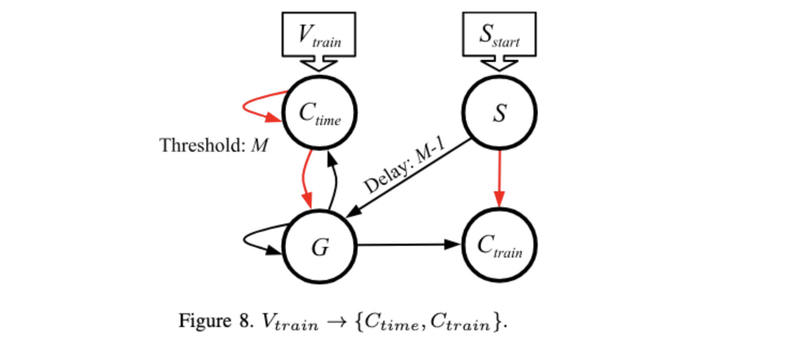

# Network to convert a spike train to a complement time or spike train: V_{train} -> C_{time} and V_{train} -> C_{train}

This is Figure 8 in the paper:



If you haven't done so already, I recommend going through the
[main README for this repo](../README.md), and its 
[accompanying video](X).  That will get you familiar with RISP, the open-source framework,
and how we walk through these networks.

The main shell script for this network is 
`scripts/04_Train_to_C_Time.sh`.  You call it with the maximum value *M*, the value
you want to convert, and the open-source framework:

```
           # V = 3 and M = 8 means C = 5.
           # As you can see below, C_train spikes 5 times, starting at timestep 9,  and
           # C_time spikes at time 12.  The reference time is 7, so 12-7 = 5.
UNIX> sh scripts/04_Train_to_C_Time.sh 8 3 $fro
Time  0(C_time)       1(S)       2(G) 3(C_train) |  0(C_time)       1(S)       2(G) 3(C_train)
   0          -          *          -          - |          1          0          0          0
   1          -          -          -          - |          2          0          0         -1
   2          -          -          -          - |          3          0          0         -1
   3          -          -          -          - |          3          0          0         -1
   4          -          -          -          - |          3          0          0         -1
   5          -          -          -          - |          3          0          0         -1
   6          -          -          -          - |          3          0          0         -1
   7          -          -          *          - |          3          0          0         -1
   8          -          -          *          - |          4          0          0          0
   9          -          -          *          * |          5          0          0          0
  10          -          -          *          * |          6          0          0          0
  11          -          -          *          * |          7          0          0          0
  12          *          -          *          * |          0          0          0          0
  13          -          -          -          * |          0          0          0          0
  14          -          -          -          - |          0          0          0          0
  15          -          -          -          - |          0          0          0          0
  16          -          -          -          - |          0          0          0          0
UNIX>
           # V = 4 and M = 8 means C = 4.
           # As you can see below, C_train spikes 4 times, starting at timestep 9,  and
           # C_time spikes at time 11.  The reference time is 7, so 11-7 = 4.
UNIX> sh scripts/04_Train_to_C_Time.sh 8 4 $fro
Time  0(C_time)       1(S)       2(G) 3(C_train) |  0(C_time)       1(S)       2(G) 3(C_train)
   0          -          *          -          - |          1          0          0          0
   1          -          -          -          - |          2          0          0         -1
   2          -          -          -          - |          3          0          0         -1
   3          -          -          -          - |          4          0          0         -1
   4          -          -          -          - |          4          0          0         -1
   5          -          -          -          - |          4          0          0         -1
   6          -          -          -          - |          4          0          0         -1
   7          -          -          *          - |          4          0          0         -1
   8          -          -          *          - |          5          0          0          0
   9          -          -          *          * |          6          0          0          0
  10          -          -          *          * |          7          0          0          0
  11          *          -          *          * |          0          0          0          0
  12          -          -          -          * |          0          0          0          0
  13          -          -          -          - |          0          0          0          0
  14          -          -          -          - |          0          0          0          0
  15          -          -          -          - |          0          0          0          0
  16          -          -          -          - |          0          0          0          0
UNIX>
           # V = 0 and M = 8 means C = 8.
           # As you can see below, C_train spikes 8 times, starting at timestep 9,  and
           # C_time spikes at time 15.  The reference time is 7, so 15-7 = 8.
UNIX> sh scripts/04_Train_to_C_Time.sh 8 0 $fro
Time  0(C_time)       1(S)       2(G) 3(C_train) |  0(C_time)       1(S)       2(G) 3(C_train)
   0          -          *          -          - |          0          0          0          0
   1          -          -          -          - |          0          0          0         -1
   2          -          -          -          - |          0          0          0         -1
   3          -          -          -          - |          0          0          0         -1
   4          -          -          -          - |          0          0          0         -1
   5          -          -          -          - |          0          0          0         -1
   6          -          -          -          - |          0          0          0         -1
   7          -          -          *          - |          0          0          0         -1
   8          -          -          *          - |          1          0          0          0
   9          -          -          *          * |          2          0          0          0
  10          -          -          *          * |          3          0          0          0
  11          -          -          *          * |          4          0          0          0
  12          -          -          *          * |          5          0          0          0
  13          -          -          *          * |          6          0          0          0
  14          -          -          *          * |          7          0          0          0
  15          *          -          *          * |          0          0          0          0
  16          -          -          -          * |          0          0          0          0
UNIX>
           # V = 8 and M = 8 means C = 0.  See if you can figure out the rest.
UNIX> sh scripts/04_Train_to_C_Time.sh 8 8 $fro
Time  0(C_time)       1(S)       2(G) 3(C_train) |  0(C_time)       1(S)       2(G) 3(C_train)
   0          -          *          -          - |          1          0          0          0
   1          -          -          -          - |          2          0          0         -1
   2          -          -          -          - |          3          0          0         -1
   3          -          -          -          - |          4          0          0         -1
   4          -          -          -          - |          5          0          0         -1
   5          -          -          -          - |          6          0          0         -1
   6          -          -          -          - |          7          0          0         -1
   7          *          -          *          - |          0          0          0         -1
   8          -          -          -          - |          0          0          0          0
   9          -          -          -          - |          0          0          0          0
  10          -          -          -          - |          0          0          0          0
  11          -          -          -          - |          0          0          0          0
  12          -          -          -          - |          0          0          0          0
  13          -          -          -          - |          0          0          0          0
  14          -          -          -          - |          0          0          0          0
  15          -          -          -          - |          0          0          0          0
  16          -          -          -          - |          0          0          0          0
UNIX> 
```
